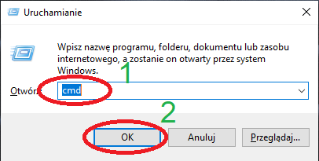

# 08a - Instalacja Python na domowym komputerze

## Czym jest Python?

Python to projekt Open Source interpretowalnego języka programowania wysokiego poziomu. Python posiada rozbudowany wachlarz bibliotek, które pozwalają na wykonanie wielu prostych i skomplikowanych zadań. Czyni to z Pythona, obok języka *R* i *Matlab/GNU Octave*, jedno z najpopularniejszych aktualnie narzędzi do analizy danych. Równocześnie Python świetnie sprawdza się jako rozwiązanie narzędziowe do realizacji szeregu zadań wymaganych w zaawansowanym użytkowaniu komputerów osobistych. Zaletą Pythona jest jego wielo-platformowość,  poprawnie napisany skrypt uruchomimy na systemach Windows, Linux i OS X.

### Wersje Pythona: Python 3 czy Python 2?

**Zdecydowanie Python 3!**. Aktualnie utrzymywane są dwie główne wersje interpretera: 3 oraz 2 (Python 3.74 i Python 2.7.16 w momencie pisania instrukcji). Dzieje się tak ze względu na konieczność utrzymania kompatybilności wstecznej. Obie wersje różnią się na tyle, że uruchomienie skryptu w nieprawidłowej wersji skończy się niepowodzeniem. Dla nowych projektów Python 3 jest najlepszym wyborem.

## Instalacja interpretera *python3*

### Microsoft Windows 10

**UWAGA** Instalacja Pythona z *Microsoft Store* wymaga aktualizacji systemu do najnowszej wersji. W większości wypadków *Windows Update* wbudowany w system jest wystarczający. W przypadku problemów z ściągnięciem Pythona z *Microsoft Store* zaktualizuj system używając programu dostępnego pod przyciskiem ***Update Now*** na stronie: https://www.microsoft.com/en-us/software-download/windows10

Aktualnie Microsoft udostępnia instalację najnowszej wersji Pythona wprost z *Microsoft Store*, jest to zalecany sposób instalacji. W tym celu odszukaj w systemie *Microsoft Store*: wciśnij przycisk **Windows** (1), zacznij wpisywać na klawiaturze **Microsoft Store** (2), a następnie z znalezionych wyników wybierz aplikację (3).


Za pomocą wyszukiwarki w prawym górnym rogu wyszukaj frazę **python**, wciśnij `ENTER`.


Z wyników wyszukiwania, z kategorii **Apki** wybierz najnowszą wersję Pythona (**bez Beta!**). W momencie pisania instrukcji jest to Python 3.7.


Kliknij **Pobierz**. W przypadku braku konta *Microsoft* na używanym przez nas komputerze zostaniemy zapytani o chęć zalogowania, nie musimy tego robić i klikamy *Nie, dziękuję*.


Czekamy na zakończenie procesu instalacji i zamykamy *Microsoft Store*.

### Linux Ubuntu 18.04

W Ubuntu 18.04 Python 3 jest zainstalowany domyślnie razem z instalacją systemu. Konieczne jest jedynie instalacja menadżera pakietów dla Pythona 3 czyli *pip3*.

W celu instalacji otwórz terminal wciskając na klawiaturze kombinację klawiszy: `Ctrl + Alt + T`. Następnie wykonaj następujące komendy (przepisz/wklej i zatwierdź wciskając `ENTER`):

1. Zacznij od zaktualizowania listy pakietów (przy wykonaniu pierwszej komendy pojawi się pytanie o hasło użytkownika, należy je wpisać i zatwierdzić klawiszem `ENTER`):

```shell
sudo apt update
```

2. Zainstaluj menadżer *pip* dla Python 3:

```shell
sudo apt install python3-pip
```

### Mac OS X

TODO

## Instalacja pakietów dla Python 3

Czysta instalacja Pythona dostarcza jedynie podstawowej funkcjonalności języka. Pomimo, że jest to rozbudowany i wielozadaniowy język skryptowy możliwe jest rozszerzenie jego funkcjonalności poprzez instalację pakietów. Istnieje cały szereg pakietów, począwszy od pakietu automatyzującego wyświetlanie pasków postępu ([tqdm](https://github.com/tqdm/tqdm)), na narzędziach do uczenia głębokich sieci neuronowych ([PyTorch](https://pytorch.org/)) skończywszy.

Instalacja pakietów zazwyczaj wykonywana jest za pomocą menażera pakietów dla Pythona czyli *pip*. Wywołanie menadżera pakietów odbywa się z linii poleceń. Uruchomienie linii poleceń różni się zależnie od systemu. Uruchom terminal zgodnie z poniższą instrukcją, zależnie od wykorzystywanego systemu operacyjnego:

### Microsoft Windows 10

Na klawiaturze wciśnij kombinację klawiszy: `Windows + R`. Pojawi się okienko *Uruchamianie*. Wpisz na klawiaturze frazę **cmd** (1), a następnie zatwierdź wciskając `ENTER` lub **OK** (2).



### Linux Ubuntu

Wciśnij na klawiaturze kombinację klawiszy: `Ctrl + Alt + T`.

### Mac OS X

TODO

### Właściwa instalacja pakietów

W otwartym terminalu wykonaj następujące komendy (przepisz/wklej i zatwierdź wciskając `ENTER`):

1. Wykonaj aktualizację menadżera pakietów *pip*:

```shell
pip3 install --upgrade pip
```

2. Zainstaluj wykorzystywane na zajęciach pakiety:

```shell
pip3 install numpy pandas matplotlib jupyter
```

Powyższa komenda zainstaluje następujące pakiety:

- [NumPy](https://numpy.org/) - podstawowy pakiet do obliczeń, zawiera między innymi operacje macierzowe,
- [Pandas](https://pandas.pydata.org/) - zaawansowana biblioteka struktur danych oparta na NumPy,
- [Matplotlib](https://matplotlib.org/) - pakiet rysujący wykresy,
- [Jupyter](https://jupyter.org/) - interaktywne środowisko programistyczne i obliczeniowe.

## Instalacja PyCharm

TODO

---

Autorzy: *Tomasz Mańkowski*, *Jakub Tomczyński*
