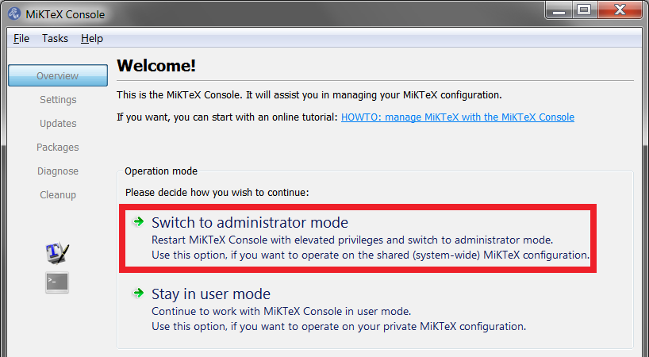
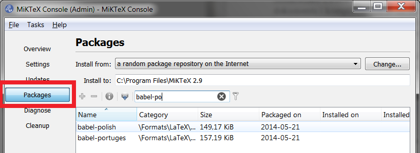
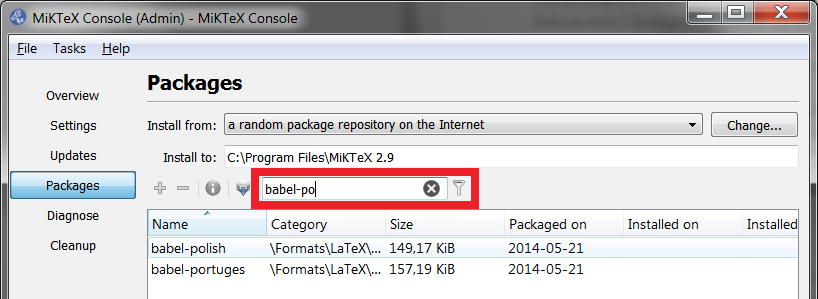
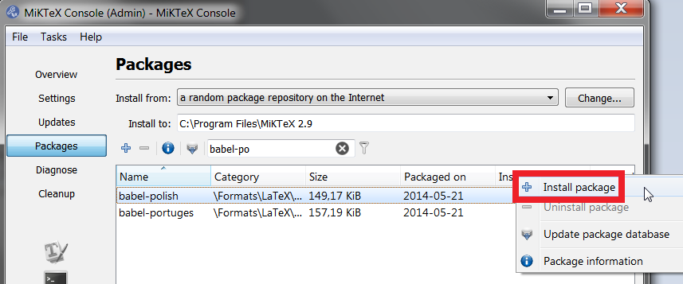
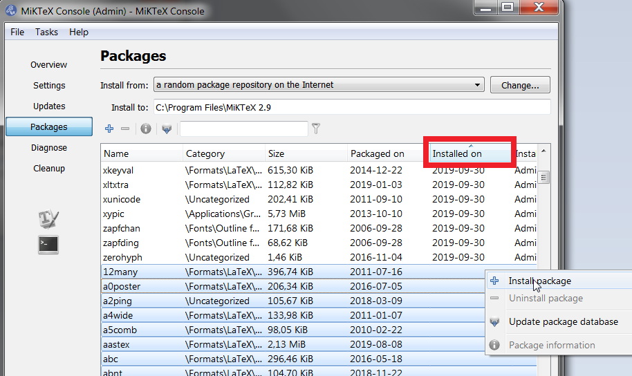
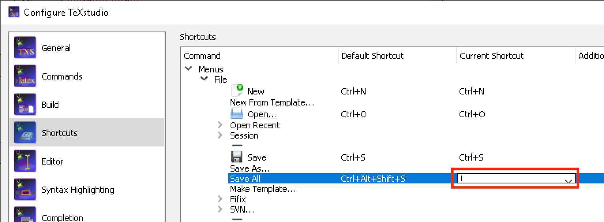

# 00 - Instalacja LaTeX na domowym komputerze

**UWAGA** Poprawna instalacja środowiska wymaga instalacji programów w podanej w instrukcji kolejności, tj.:

1. MiKTeX
2. TeXStudio

W przypadku niezachowania opisywanej kolejności mogą wystąpić problemy z poprawną konfiguracją środowiska.

Środowisko LaTeX składa się z wielu oddzielnych programów przetwarzających pliki z kodem dokumentu i kompilujących je do formatu docelowego, jak na przykład pdf.

## MiKTeX

Konieczna jest instalacja całego środowiska a nie tylko edytora w którym następnie będą pisane dokumenty. Takim środowiskiem jest **MiKTeX**:

[https://miktex.org/](https://miktex.org/)

W celu instalacji tego środowiska należy przejść do działu *downloads* na powyższej stronie, wybrać system operacyjny. Po instalacji należy uruchomić program **MiKTeX Console** (dla systemów Windows: Start → MiKTeX → MiKTeX Console) i przejść w tryb administratora:

Następnie należy wybrać menu pakiety:

Aby móc kompilować prawidłowe dokumenty w języku polskim należy doinstalować dodatkowe pakiety:

- *babel-polish*
- *polski*

W tym celu należy je wyszukać na liście pakietów:

Wywołanie instalacji odbywa się poprzez kliknięcie prawym przyciskiem myszy na wierszu danego pakietu i wybranie opcji **instaluj**:

Przydatne może być zainstalowanie wszystkich dostępnych pakietów. W tym celu należy uporządkować listę pakietów według daty instalacji i zaznaczyć wszystkie pakiety niezainstalowane:

**UWAGA** Pełna instalacja środowiska będzie wymagała nawet 7 GB miejsca na dysku i może zająć nawet kilka godzin, zależnie od szybkości łącza i dostępności serwerów.

## TeXStudio

Dopiero po instalacji środowiska MiKTeX można przystąpić do instalacji edytora. W ramach zajęć zalecany jest edytor TeXStudio:

[https://www.texstudio.org/](https://www.texstudio.org/)

Program ten podczas instalacji powinien sam wykryć środowisko MiKTeX w systemie. W przypadku problemów należy zgłosić się do prowadzącego zajęcia.

**UWAGA** Domyślne skróty klawiszowe w programie mogą kolidować ze kombinacjami klawiszy używanymi do wstawiania polskich znaków diakrytycznych (np ś, Ź). W celu wyeliminowania tego problemu wejdź w ustawienia programu (menu *Options* → *Configure TexStudio...*) zakładka *Shortcuts*. Problematyczne komendy to: *Menus* → *File* → *Save All* oraz *Menus PDF-Viewer* → *View* → *External Viewer*. Deaktywuj przypisane tym poleceniom skróty klikając dwukrotnie na skrót w kolumnie *Current Shortcut*, kasując bieżące ustawienie klawiszem `Backspace` lub `Delete` i zatwierdzając klawiszem `Enter`:

---

Autorzy: *Rafał Kabaciński*, *Tomasz Mańkowski*, *Jakub Tomczyński*
