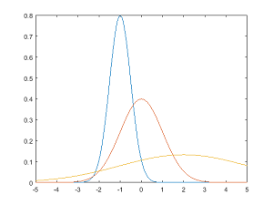
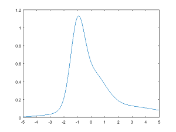
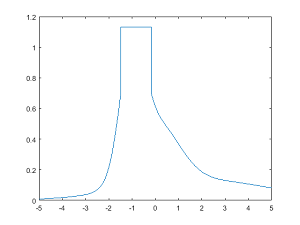

# PRZYKŁADOWE Kolokwium I - LaTex i Matlab

Kolokwium trwa 90 minut. Na kolokwium pracujemy samodzielnie. Jakiekolwiek próby ściągania wykryte w trakcie trwania testu jak i w procesie sprawdzania skutkują oceną niedostateczną. Niedozwolone jest korzystanie z Internetu, za wyjątkiem materiałów udostępnionych na zajęciach na stronie: [http://jug.put.poznan.pl/lab-ti](http://jug.put.poznan.pl/lab-ti). Niedozwolone jest korzystanie z tzw. "gotowców".

Przed końcem czasu rozwiązanie kolokwium należy umieścić w przygotowanym przez prowadzącego miejscu na kursie Moodle. Czas otwarcia zadania jest ograniczony, pamiętaj aby wgrać rozwiązania przed upływem czasu! Zadanie akceptuje pliki o rozszerzeniach: `.tex`, `.eps`, `.png` i `.m`.

Na Moodle do oceny umieść następujące pliki:

- *skrypt.m*
- *kolokwium.tex*
- *pies.png*
- *wykres.eps*

## Zadanie 1

Napisz skrypt *skrypt.m* dla środowiska Matlab/GNU Octave:

- Krzywa Gaussa opisana jest równaniem (e^x to `exp(x)`):

- Dla wartości x = <-5. 5>, z krokiem 0.01, oblicz wartości funkcji g(x) dla następujących parametrów:
     - μ = -1; σ = 0.5,
     - μ = 0; σ = 1,
     - μ = 2; σ = 3.

- Wykreśl na pierwszym wykresie wszystkie 3 uzyskane krzywe Gaussa. Dodaj opisy osi: *x* oraz *g(x)*. Dodaj tytuł wykresu: *Krzywe Gaussa*. Dodaj legendę dla 3 kolejnych krzywych:
     - *u=-1; o=0.5*
     - *u=0; o=1*
     - *u=2; o=3*

- Wykonaj sumowanie 3 uzyskanych krzywych Gaussa. Wynik wykreśl na drugim wykresie (w nowym oknie). Dodaj opisy osi: *x* oraz *g(x) - sum*. Dodaj tytuł wykresu: *Suma krzywych Gaussa*. Dodaj siatkę pomocniczą. Zapisz wykres do pliku *wykres.eps*.

- Znajdź wartość maksymalną z sumy 3 krzywych Gaussa. Następnie w punktach gdzie wartość funkcji przekracza 0.7 przypisz uzyskaną wartość maksymalną. Wynik wykreśl na trzecim wykresie (w nowym oknie). Dodaj opisy osi: *x* oraz *g(x) - modified*. Dodaj tytuł wykresu: *Zmodyfikowana suma krzywych Gaussa*. Dodaj siatkę pomocniczą.

## Zadanie 2

Korzystając z języka składu tekstu LaTeX odtwórz dostarczony na Moodle plik: *kolokwium.pdf*. W dokumencie umieszczono pliki graficzne *pies.png* i *wykres.eps*, także umieszczone na Moodle. Umieszczając rozwiązanie na Moodle plik *wykres.eps* zastąp plikiem wygenerowanym w ***Zadaniu 1***. *Imię i Nazwisko, grupa XX* zamień na właściwe dla siebie dane. W odpowiednie miejsce w dokumencie wstaw kod źródłowy z ***Zadania 1***. Wykonując w dokumencie referencje do poszczególnych elementów, korzystaj z mechanizmu automatycznych referencji.

---

Autorzy: *Tomasz Mańkowski*, *Jakub Tomczyński*
