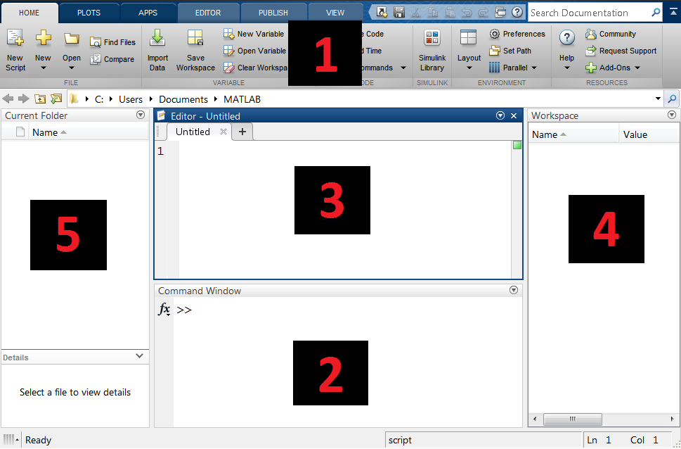
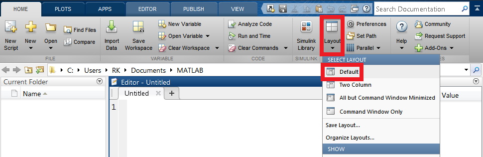
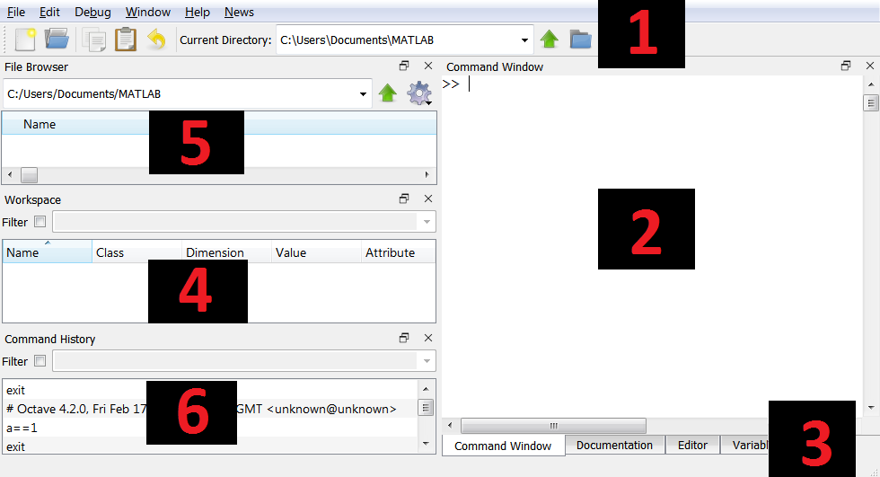
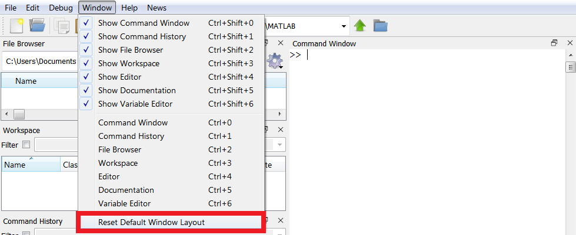

# 04b - Matlab podstawy

## Czym jest Matlab?

**Matlab** to zintegrowane środowisko do obliczeń matematycznych, inżynierskich i prowadzenia symulacji oraz powiązanego z nim języka programowania. Jego nazwa wywodzi się od **MATrix LABoratory**, czyli laboratorium macierzy. Obecnie jednak jego możliwości wykraczają daleko poza obliczenia macierzowe, a sam program stosowany jest w wielu różnych dziedzinach. Poza podstawowym środowiskiem dostępne są liczne specjalizowane biblioteki narzędzi nazywane **toolbox**ami. Pośród alternatyw dla **Matlaba** wyróżnia się otwarto-źródłowy pakiet **GNU Octave**, którego jednym z celów jest kompatybilność z językiem **Matlab**.

Ponieważ pierwotnym przeznaczeniem środowiska było prowadzenie interaktywnych obliczeń, **Matlab** jest językiem interpretowanym a nie kompilowanym w przeciwieństwie do na przykład języków **C**, **C++**. 

---

#### :hammer: :fire: Zadanie :fire: :hammer:

Uruchom środowisko Matlab.

---

## Interfejs Matlab i GUI dla GNU Octave

Poniżej przedstawiono główne okno graficznego środowiska Matlab:



Narzędzia pogrupowane są w tak zwane wstążki, znajdujące się u góry okna (1). Linia komend (2) znajdująca się u dołu okna służy do prowadzenia interaktywnych obliczeń. Bardziej rozbudowane obliczenia umieścić można w plikach skryptów. Edytor takich plików znajduje się pośrodku (3). Po prawej stronie znajduje się przestrzeń robocza (4), a po lewej podgląd plików w bieżącym folderze (5).

Jeżeli wygląd okna został zmieniony względem domyślnego, można go przywrócić. Służy do tego narzędzie **Layout** znajdujące się po środku wstążki **Home**:



Główne okno GUI dla GNU Octave ma zbliżoną konfigurację:



Podstawowe narzędzia dostępne są u góry okna (1). Linia komend (2) znajduje się po prawej. Może ona być jednak przełączona między innymi na edytor skryptów za pomocą zakładek dostępnych u dołu okna (3). Po lewej stronie, po środku znajduje się przestrzeń robocza (4). Nad nią z kolei umieszczono podgląd plików w bieżącym folderze (5). Pod przestrzenią roboczą znajduje się sub-okno z historią komend.

Jeżeli wygląd okna został zmieniony względem domyślnego, można go przywrócić. Służy do tego ostatnia opcja z menu **Window**:



## Podstawy Matlab

### Podstawowe operacje na liczbach

W Matlab możemy korzystać z podstawowych matematycznych operatorów: `+`, `-`, `*`, `/` itp. przy zachowaniu standardowej kolejności wykonywania działań. Do zmiany kolejności działań wykorzystujemy nawiasy okrągłe `()`:

```matlab
>> 3 + 5

ans =
     8

>> 9 - 8 * 100

ans =
  -791

>> (9 - 8) * 100

ans =
   100

>> 100 / 6

ans =
   16.6667
```

Potęgowanie wykonywane jest z użyciem operatora `^`:

```matlab
>> 2 ^ 16

ans =
       65536
```

---

#### :hammer: :fire: Zadanie :fire: :hammer:

1. W konsoli Matlab sprawdź działanie powyższych operatorów.

2. Rakieta przyspiesza jednostajnie z przyspieszeniem 100 m/s^2. Oblicz jaką drogę przebędzie w przeciągu 10 s. **PODPOWIEDŹ** 

---

Kolejne polecenia wpisane w linii komend zapisywane są do historii. Można się do nich odwołać za pomocą strzałek góra/dół na klawiaturze. W Matlabie wciśnięcie strzałki w górę wywołuje sub-okno historii, w Octave jest ono domyślnie widoczne cały czas po lewej stronie. Wywołane z historii komendy można edytować.

---

#### :hammer: :fire: Zadanie :fire: :hammer:

Sprawdź działanie historii w Matlab.

---

### Zmienne

Matlab umożliwia przechowywanie wartości w zmiennych. Przypisanie wartości do zmiennej odbywa się za pomocą operatora `=`. Typ zmiennym nadawany jest automatycznie przez środowisko zależnie od tego co zostanie do nich przypisane:

```matlab
>> base = 20

base =
    20

>> height = 3

height =
     3

>> base * height / 2

ans =
    30
```

Można także zapisać wynik działania do zmiennej:

```matlab
>> netto = 100

netto =
   100

>> tax = 1.23

tax =
    1.2300

>> brutto = netto * tax

brutto =
   123
```

Ciągi znakowe definiuje się za pomocą znaków apostrofu `'` na początku i na końcu. Jeżeli w ciągu znaków chcemy zastosować znak `'` konieczne będzie poprzedzenie go drugim apostrofem `''`:

```plain
>> s1 = 'Ala ma kota'

s1 =
    'Ala ma kota'

>> s2 = 'This is Ala''s cat'

s2 =

    'This is Ala's cat'
```

---

#### :hammer: :fire: Zadanie :fire: :hammer:

1. Korzystając z konsoli przypisz do zmiennej `d` wartość przekątnej kwadratu.
2. Oblicz i zapisz do zmiennej `a` wartość boku kwadratu. **PODPOWIEDŹ** , pamiętaj, że pierwiastek kwadratowy z liczby, to to samo co podniesienie tej liczby do potęgi 0.5.
3. Na podstawie uzyskanego wyniku oblicz pole koła wpisanego w kwadrat. **PODPOWIEDŹ** Wartość π można uzyskać używając komendy `pi`.

---

### Operacje na wektorach i macierzach

#### Wektory

W Matlabie do definiowania wektorów służą nawiasy kwadratowe `[]`, wektor wypełniamy wartościami oddzielając je spacjami:

```matlab
>> primes = [2 3 5 7 11 13 17 19 23 29 31 37]
```

Do elementów wektora możemy odwoływać się wykorzystując operator `()`. Możliwy jest dostęp do pojedynczego elementu (lista indeksowana jest od 1), lub do jego zakresu :

```matlab
>> primes(1)

ans =
     2

>> primes(2:5) % zakres prawostronnie zamknięty

ans =
     3     5     7    11

>> primes(3:end) %  od indeksu początkowego do końca

ans =
     5     7    11    13    17    19    23    29    31    37


>> primes(1:2:end) % co drugi element z listy

ans =
     2     5    11    17    23    31
```

W Matlabie istnieje możliwość tworzenia wektorów kolumnowych, przez oddzielanie kolumn znakami `;`:

```matlab
>> a = [1; 2; 3; 4]

a =
     1
     2
     3
     4
```

Ten sam efekt można uzyskać stosując operator transpozycji `'`:

```matlab
>> a = [1 2 3 4]

a =
     1     2     3     4

>> a'

ans =
     1
     2
     3
     4
```

Wektory można sklejać umieszczając je wewnątrz nawiasów kwadratowych `[]`:

```matlab
>> a = [1 2]

a =
     1     2

>> b = [3 4]

b =
     3     4

>> [a b]

ans =
     1     2     3     4
```

Istnieje możliwość tworzenia wektorów jako zakresów korzystając z operatora `:`:

```matlab
>> x = [1:10]

x =
     1     2     3     4     5     6     7     8     9    10
```

Możliwe jest także zadanie innego niż 1 kroku:

```matlab
>> t = [0:0.01:1] % tworzy wektor o długości 101,
                  % z zakresu od 0 do 1, z krokiem 0.01

>> z = [10:2:20] % tworzy wektor o długości 6,
                 % z zakresu od 10 do 20, z krokiem 2
```

Wektory o tej samej długości można dodawać i odejmować (`+`, `-`):

```matlab
>> a = [1 2 3 4 5]

a =
     1     2     3     4     5

>> b = [6 7 8 9 10]

b =
     6     7     8     9    10

>> a + b

ans =
     7     9    11    13    15

>> a - b

ans =
    -5    -5    -5    -5    -5
```

Mnożenie wektorów wykonywane jest za pomocą operatora `*`.  Mnożąc wektor wierszowy przez wektor kolumnowy uzyskujemy operację iloczynu wektorowego:

```matlab
>> a * b'

ans =
   130
```

Wektory można także pomnożyć po elementach korzystając z operatora `.*`:

```matlab
>> a .* b

ans =
     6    14    24    36    50
```

Długość wektora możemy uzyskać korzystając z funkcji `length()`:

```matlab
>> length(a)

ans =
     5
```

#### Macierze

W Matlab macierze definiujemy w sposób identyczny jak wektory, wiersze oddzielamy za pomocą średnika (`;`):

```matlab
>> y = [1 2 3; 4 5 6; 7 8 9]

y =
     1     2     3
     4     5     6
     7     8     9
```

Do poszczególnych elementów odwołujemy się przekazując w nawiasach `()` dwie wartości oddzielone przecinkami. Podajemy najpierw wiersz, potem kolumnę. Indeksowane od 1:

```matlab
>> y(1,3)

ans =
     3

>> y(1:2,1:2)

ans =
     1     2
     4     5
```

Tak samo jak w przypadku wektorów możemy wykonać operacje: `+`, `-`, `*`, `.*`, `/`, `./`. Transpozycję macierzy wykonujemy korzystając z operatora `'`. Pamiętaj, że kolejność mnożenia macierzy ma znaczenie:

```matlab
>> y * y'

ans =
    14    32    50
    32    77   122
    50   122   194

>> y' * y

ans =
    66    78    90
    78    93   108
    90   108   126
```

Matlab umożliwia wykonanie operacji macierzy ze skalarem, na przykład:

```matlab
>> y * 3

ans =
     3     6     9
    12    15    18
    21    24    27

>> y + 3

ans =
     4     5     6
     7     8     9
    10    11    12
```

Rozmiar macierzy możemy uzyskać korzystając z funkcji `size()`. Zwraca ona dwuelementowy wektor określający liczbę wierzy i liczbę kolumn w macierzy:

```matlab
>> c = [1 2 3; 4 5 6]

c =
     1     2     3
     4     5     6

>> size(c)

ans =
     2     3
```

---

#### :hammer: :fire: Zadanie :fire: :hammer:

1. Utwórz 3 wektory pionowe o długości 5 wypełnione różnymi wartościami. Następnie wykonaj sklejenie tych wektorów w celu uzyskania macierzy.
2. Wykonaj przemnożenie uzyskanej macierzy przez transpozycję tej samej macierzy.
3. Uzyskaną macierz przemnóż przez 10.

---

#### Definiowanie podstawowych macierzy

Oprócz możliwości zdefiniowania całej macierzy ręcznie, pewne typy macierzy można zdefiniować  a pomocą dedykowanych funkcji. Jak argumenty podaje się w nich kolejno liczbę wierszy i kolumn. Podanie jednej liczby jako argumentu będzie skutkować powstaniem macierzy kwadratowej.

```matlab
>> zeros(3,3) % macierz zer

ans =
     0     0     0
     0     0     0
     0     0     0

>> ones(2,5) % macierz jedynek

ans =
     1     1     1     1     1
     1     1     1     1     1

>> eye(4) % macierz jednostkowa

ans =
     1     0     0     0
     0     1     0     0
     0     0     1     0
     0     0     0     1

>> rand(2,2) % Macierz losowych wartości z przedziału <0, 1>

ans =
    0.8147    0.1270
    0.9058    0.9134
```

---

#### :hammer: :fire: Zadanie :fire: :hammer:

Korzystając z powyższych funkcji stwórz macierz zawierającą same liczby 5 o rozmiarach 4 na 6 (wiersze, kolumny).

---

### Podstawowe funkcje matematyczne

Matlab posiada szeroki wachlarz wbudowanych funkcji, poniżej przedstawiono tylko małą część z nich:

|Nazwa|Opis|
|-|-|
|sin(a)|funkcje trygonometryczne, argument w radianach|
|cos(a)||
|tan(a)||
|cot(a)||
|sind(a)|funkcje trygonometryczne, argument w stopniach|  
|cosd(a)||
|tand(a)||
|cotd(a)||
|sqrt(a)|pierwiastek kwadratowy|
|exp(a)|funkcja eksponencjalna (e^a)|
|log(a)|logarytm naturalny|
|log10(a)|logarytm o podstawie 10|
|abs(a)|wartość bezwzględna|

Przykład użycia:

```matlab
>> sin(pi/2)

ans =
     1

>> sin([0:5])

ans =
     0    0.8415    0.9093    0.1411   -0.7568   -0.9589
```

---

#### :hammer: :fire: Zadanie :fire: :hammer:

1. Utwórz wektor zawierający liczby całkowite od -10 do 10.
2. Korzystając z poznanych funkcji wyświetl wartości bezwzględne wartości w wektorze i zapisz do nowego wektora.
3. Oblicz pierwiastek wszystkich elementów w nowym wektorze.

---

## Skrypty wykonywalne

Kiedy chcemy stworzyć użytkowy kod wskazane jest, aby do nie wykorzystywać do konsoli, lecz zapisać nasz kod w pliku, który wykonamy w całości, a nie jak dotychczas wpisując pojedyncze komendy. W przypadku Matlab pliki skryptowe posiadają rozszerzenie `.m`. Nowy skrypt możemy utworzyć klikając wstążkę **HOME**, a następnie **New Script**. Zostanie otwarte nowe edytora skryptów (**Editor**). Następnie można zapisać skrypt klikając **Save** we wstążce **EDITOR**.

---

#### :hammer: :fire: Zadanie :fire: :hammer:

1. Utwórz nowy skrypt.
2. Zapisz go pod nazwą: *my_first_script.m*.

---

W celu uruchomienia skryptu wciskamy **RUN** w wstążce **EDITOR**. Można także wcisnąć klawisz **F5** na klawiaturze. Wynik działania skryptu pojawi się w konsoli.

---

#### :hammer: :fire: Zadanie :fire: :hammer:

1. Do nowo utworzonego skryptu dodaj prosty kod, na przykład:

```matlab
a = 1
b = 4

a * b
```

2. Uruchom skrypt.

---

Domyślnie Matlab wyświetla wynik każdej operacji. Każda komenda może zostać *wyciszona* przez umieszczenie średnika (`;`) na końcu komendy.

---

#### :hammer: :fire: Zadanie :fire: :hammer:

1. Zmodyfikuj wcześniejszy skrypt tak aby w czasie deklaracji zmiennych nie był wyświetlany wynik operacji.
2. Uruchom skrypt.

---

Każdy skrypt można wywołać bezpośrednio z konsoli wpisując nazwę skryptu. Możliwe jest także uruchomienie skryptu z wnętrza innego skryptu, także poprzez wywołanie jego nazwy.

---

#### :hammer: :fire: Zadanie :fire: :hammer:

Wywołaj skrypt *my_first_script* z poziomu konsoli.

---

## Wykresy

Do wyświetlania wykresów w Matlabie służy funkcja `plot(x,y)`. Pierwszym argumentem jest wektor zawierający współrzędne odciętych (`x`), a drugim wektor zawierający współrzędne rzędnych (`y`). Kolejne punkty łączone są liniami prostymi.

---

#### :hammer: :fire: Zadanie :fire: :hammer:

1. Skopiuj poniższy kod do własnego skryptu i uruchom:

```matlab
x = [1 2 3 4];
y = [1 2 3 4];

plot(x,y,'-o')

grid on
```

2. Zmień wartość wektora `y` na `[1 2 1 2]`. Uruchom skrypt i zobacz wynik.
3. Zmień wartość wektora `x` na `[1 2 2 1]`. Uruchom. Funkcja plot nie sprawdza czy dany wykres jest funkcją więc możliwe jest rysowanie dowolnych krzywych.

---

Trzecim argumentem funkcji plot jest ciąg formatujący. Może on zawierać specyfikację koloru i typu linii oraz typu markera w punktach danych. Pomoc do wszystkich funkcji Matlab można uzyskać wpisując `doc nazwa_funkcji`, na przykład:

```matlab
doc plot
```

---

#### :hammer: :fire: Zadanie :fire: :hammer:

1. Korzystając z konsoli otwórz dokumentację funkcji `plot`.
2. Przejdź do sekcji **Input Arguments** -> **Line Spec**.
3. Zmodyfikuj skrypt tak aby wykres wyświetlany był przerywaną linią w kolorze czerwonym, a każdy punkt wykresu był oznaczany krzyżykiem.

---

Kolejne wywołania funkcji plot domyślnie nadpisują zawartość umieszczoną w poprzednim oknie rysunków. Można zmienić to za pomocą polecenia:

```matlab
hold on
```

Po jego użyciu w danym oknie rysunkowym kolejne wywołania funkcji plot będą dodawać wykresy w tych samych osiach. Tryb ten można zakończyć za pomocą polecenia:

```matlab
hold off
```

Nowe okno rysunkowe otworzyć można za pomocą polecenia:

```matlab
figure
```

**UWAGA** Polecenia plot, oraz pokrewne, rysują w ostatnim aktywnym oknie. Jeżeli użytkownik nie zamknie okna z poprzedniego uruchomienia skryptu wykres będzie dodany do poprzedniego okna i zostanie ono przesunięte na wierzch.

Pozostałe polecenia przydatne przy generowaniu wykresów:

- `grid on` - siatka pomocnicza,
- `axis tight` - usunięcie pustych przestrzeni wokół wykresu,
- `axis equal` - równe skale na osiach,
- `title('string')` - tytuł wykresu,
- `xlabel('x')` - etykieta osi x,
- `ylabel('y')` - etykieta osi y,
- `legend('variable1', 'variable2', ...)` - legenda wykresu,
- `xlim([xmin xmax])` - ustawianie zakresu osi x,
- `ylim([ymin ymax])` - ustawianie zakresu osi y.

## Zadanie końcowe :fire: :hammer:

1. Utwórz wektor `t = [0:0.01:1]`. Przygotuj w skrypcie wykresy funkcji sinus o częstotliwościach **2 Hz** i **10 Hz**. Kolor linii ustaw na odpowiednio zielony i czerwony, dodaj tytuł wykresu, opisy osi, legendę , siatką pomocniczą i ustaw zakresy osi y między **-1.2** a **1.2**.


2. Wyznacz wektor będący sumą obliczonych w poprzednim zadaniu składowych sinusoidalnych. Wykreśl przebieg na tym samym wykresie, w kolorze niebieskim. Zmień zakres osi y na **-2.5** do **2.5**.

3. Oblicz wartość średnio-kwadratową (RMS) z wynikowego sygnału z poprzedniego zadania. **PODPOWIEDŹ** Do obliczenia średniej wykorzystaj funkcję `mean()`, zwróć uwagę, że elementy wektora muszą zostać podniesione do kwadratu.


## Zadanie domowe :boom: :house:

#### Zadanie 1

Dany jest wektor `x` o wartościach `[-10:0.01:10]`. Oblicz wartości funkcji danych następującymi wielomianami:


Wyświetl oba wielomiany na wykresie. Znajdź średnią, minimalną i maksymalną wartość funkcji w tym zakresie (`mean()`, `min()`, `max()`).

#### Zadanie 2

Dowiedz się jak umieścić w jednym oknie więcej niż jeden wykres, skorzystaj z wbudowanej pomocy:

```matlab
doc subplot
```

Utwórz jedno okno na którym umieścisz dwa wykresy, jeden po drugim. Podobnie jak w zadaniu końcowym 1 i 2 na jednym wykresie umieść składowe sygnału o częstotliwościach **2 Hz** i **10 Hz**. Na wykresie pod spodem umieść sumę tych sygnałów.

---

Autorzy: *Rafał Kabaciński*, *Tomasz Mańkowski*
