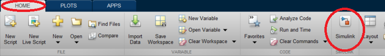
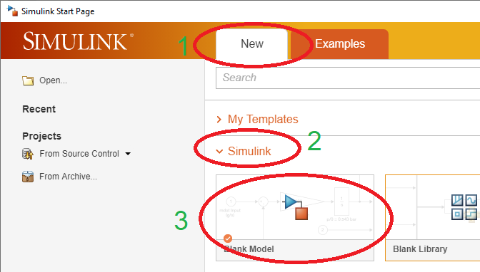
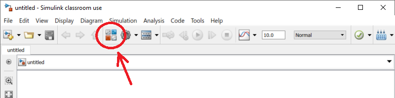
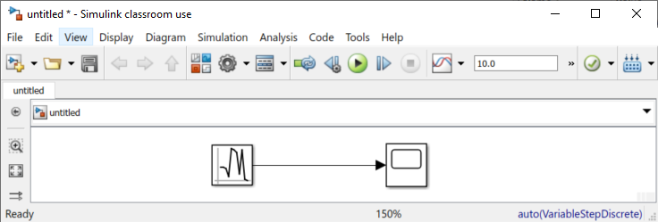
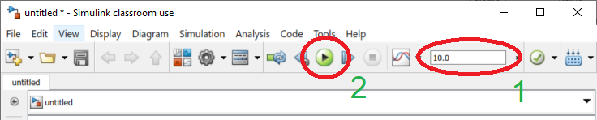
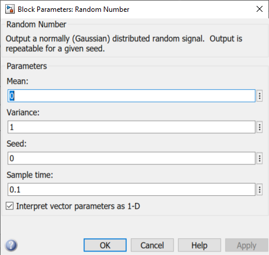
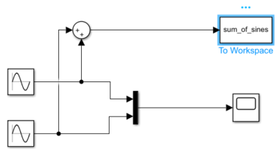
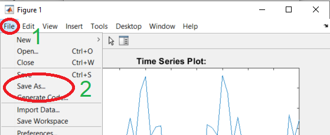
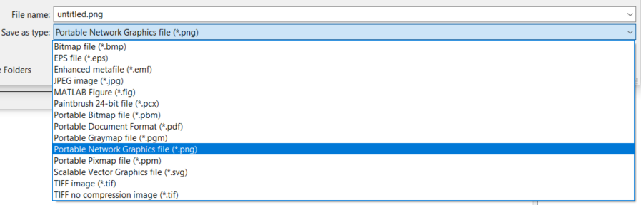
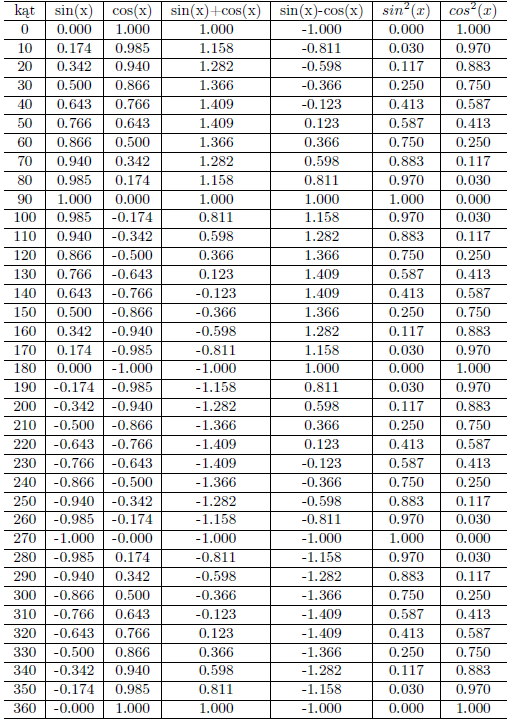

# 06 - Simulink, prezentacja wyników w LaTeX

## Simulink

Simulink jest graficznym środowiskiem do przeprowadzania symulacji komputerowych, będący częścią pakietu Matlab. Simulink **NIE** jest dostępny w GNU Octave.

### Rozpoczęcie pracy z Simulink

Aby uruchomić Simulink należy w linii polecań Matlab należy wpisać komendę `simulink`, lub kliknąć przycisk **HOME** &rarr; **Simulink**



Zostanie otwarta strona startowa. Aby utworzyć nowy pusty model Simulink klikamy **New** (1), następnie wybieramy zakładkę **Simulink** (2) i klikamy **Blank Model** (3):



Otwarte zostanie puste okno z miejscem gdzie możemy zacząć budować symulację za pomocą zestawu bloczków. W celu otwarcia biblioteki Simulink wybieramy z menu **View** &rarr; **Library Browser** (`Ctrl+Shift+L`) lub klikając przycisk:



### Pierwszy model w Simulink

Większość podstawowych bloczków wykorzystywanych w Simulink znajdziemy w kategorii ***Simulink***, najpopularniejsze znajdują się w podkategorii ***Commonly Used Blocks***. Bloczki pozwalające na generowanie sygnału znajdziemy w podkategorii ***Sources***. W podkategorii ***Sinks*** znajdziemy bloczki pozwalające wyświetlać i eksportować dane z Simulink. Dodawanie bloczków do symulacji odbywa się za pomocą metody *przeciągnij i upuść*. W podobny sposób łączymy bloczki ze sobą za pomocą strzałek.

---

#### :hammer: :fire: Zadanie :fire: :hammer:

Z biblioteki z kategorii *Sources* dodaj bloczek *Random Number*. Z kategorii *Sinks* dodaj bloczek *Scope* i połącz wyjście z generatora liczb losowych z wyświetlaczem. Jak na przykładzie poniżej:



---

W celu uruchomienia symulacji, w pierwszej kolejności należy ustalić czas symulacji (1), a następnie uruchomić symulację klikając **Run** (2):



---

#### :hammer: :fire: Zadanie :fire: :hammer:

1. Uruchom symulację swojego modelu na 5 sekund.
2. Podejrzyj wynik wyświetlony poprzez dwukrotne kliknięcie obiektu *Scope*.

---

### Zmiana parametrów bloczków

Każdy bloczek w Simulinku posiada zestaw parametrów, do którego uzyskujemy dostęp dwukrotnie klikając na zadany bloczek. Każdy bloczek będzie oferował inny zestaw parametrów, zależnie od swojego przeznaczenia. Na przykład, w przypadku generatora liczb losowych, możliwe będzie ustawienie m.in. wartości średniej i wariancji sygnału:



---

#### :hammer: :fire: Zadanie :fire: :hammer:

1. Wyedytuj parametry generatora liczb losowych, tak aby średnia wartość sygnału wynosiła -10, a wariancja 5. Uruchom ponownie symulację i podejrzyj wybnik w bloczku *Scope*.
2. Utwórz nowy model na podstawie przykładu widocznego poniżej. Parametry generowanych sygnałów sinusoidalnych ustaw w następujący sposób:
    - 1: f = 10 rad/s, A = 3
    - 2: f = 2 rad/s, A = 7



3. Uruchom symulację na 10 sekund. Podejrzyj wykres w elemencie *Scope*.
4. Element *To Workspace* eksportuje do głównego *workspace* Matlaba wynik symulacji danego sygnału i zapisuje pod zadaną nazwą. Korzystając z funkcji `plot()` wykreśl zawartość wektora `sum_of_sines`.
5. Zmień parametry ***Sample time*** obu generowanych sygnałów na 0.01. Wykonaj ponownie symulację. Podejrzyj *Scope* i wygenerowany wektor `sum_of_sines`.

---

## Eksport wyników

### Zapisywanie wykresów do plików graficznych

W Matlab każdy wygenerowany wykres możemy zapisać do pliku graficznego. W tym celu w oknie wykresu wybieramy **File** (1) &rarr; **Save As...** (2):



Następnie w oknie zapisu możemy wybrać spośród szeregu formatów graficznych:



Spośród dostępnych formatów najlepiej wybrać:

- `.eps` - *Encapsulated Postscript* - format wektorowy plików używanych w składach testów - wybierz ten format jeżeli chcesz wstawić wykres na przykład w LaTeX,
- `.svg` -  *Scalable Vector Graphics* - uniwersalny format grafiki wektorowej - użyj go jeżeli chcesz umieścić wykres na stronie internetowej,
- `.png` - *Portable Network Graphics* - uniwersalny, bezstratny rastrowy format plików graficznych - wykorzystaj w wypadku gdy chcesz zachować wykres do szybkiego podglądu.

---

#### :hammer: :fire: Zadanie :fire: :hammer:

1. Napisz skrypt, w którym dany jest wektor `x = [0:10:360]`, zawierający kąt od 0 do 360 stopni z krokiem 10. Dla podanych wartości kąta oblicz następujące wartości funkcji trygonometrycznych, wyniki umieść w jednej macierzy, w której w kolumnach umieścisz wartości poszczególnych funkcji dla danego kąta. Pamiętaj aby użyć funkcji trygonometrycznych przyjmujących argument w stopniach:
    - ,
    - ,
    - ,
    - ,
    - ,
    - .

2. Wartości funkcji wyświetl na wykresie. Pamiętaj, aby podać wektor `x` jako argument wykresu. 
3. Do wykresu dodaj:
    - siatkę pomocniczą,
    - tytuł: *Wartości funkcji trygonometrycznych*,
    - opis osi x: *x [stopnie]*,
    - opis osi y: *y(t)*,
    - legendę zawierającą opisy poszczególnych funkcji trygonometrycznych.
4. Zapisz wykres w formacie EPS (`.eps`).
5. Utwórz nowy dokument LaTeX typu *article* w TeXStudio. W treści dokumentu, w otoczeniu pływającym *figure* umieść zapisany do pliku EPS wykres. Dodaj opis rysunku: *Wykresy wartości wybranych funkcji trygonometrycznych*.

---

### Zapis do plików tekstowych

Do otwarcie pliku wykorzystywana jest funkcja `fopen()`, do której jako argumenty podajemy ścieżkę do pliku i argumenty z jakimi ma zostać otwarty plik (`r` - odczyt, `w` - zapis (kasuje zawartość pliku), `a` - dopisuje do końca pliku, `r+` - odczyt i zapis). Do pisania do pliku korzystamy z funkcji `fprintf()` (składnia tak jak w `C/C++`), gdzie jako pierwszy argument podajemy wskaźnik do pliku zwrócony przez `fopen()`. Celem zamknięcia pliku korzystamy z `fclose()`:

```matlab
name = 'John';

x = 1;
y = -3;
z = 9.999999999;

file = fopen('essential_data.txt', 'w');

fprintf(file, 'Very important data saved by %s:\n', name);
fprintf(file, '%d, %d, %.3f\n', x, y, z);

fclose(file);
```

> Very important data saved by John:  
> 1, -3, 10.000

---

#### :hammer: :fire: Zadanie :fire: :hammer:

1. Utwórz skrypt, który na podstawie danych (wyniku funkcji trygonometrycznych) przygotowanych w poprzednim zadaniu wygeneruje plik ***trigonometry_data.tex***, który stanie się podstawą do utworzenia tabeli w dokumencie LaTeX. W pierwszej kolumnie tabeli powinny znajdować się kolejne wartości kąta, w kolejnych kolumnach odpowiadające im wartości funkcji. Poniżej przedstawiono przykładowe dwie pierwsze linie wygenerowanego pliku. Zwróć uwagę na precyzję liczb zmienno-przecinkowych zapisanych do pliku.

> 0 & 0.000  & 1.000  & 1.000  & -1.000  & 0.000  & 1.000 \\ \hline  
> 10 & 0.174  & 0.985  & 1.158  & -0.811  & 0.030  & 0.970 \\ \hline
>  
> ...

2. W utworzonym wcześniej dokumencie LaTeX utwórz pływającą tabelę w otoczeniu *table* i umieść w niej wyniki wygenerowane za pomocą skryptu. Do umieszczenia w LaTeX fragmentów z zewnętrznego pliku wykorzystywany jest znacznik `\input{}`:

```tex
\begin{table}[h]
    \begin{tabular}{ccccccc}
        \input{trigonometry_data.tex}
    \end{tabular}
\end{table}
```

3. Wykonaj formatowanie tabeli zgodnie z przykładem poniżej:



---

## Zadanie domowe :boom: :house:

#### Zadanie 1


---

Autorzy: *Tomasz Mańkowski*
