# 08a - Instalacja Python na domowym komputerze

### Wersje Pythona: Python 3 czy Python 2?

**Zdecydowanie Python 3!**. Aktualnie utrzymywane są dwie główne wersje interpretera: 3 oraz 2 (Python 3.74 i Python 2.7.16 w momencie pisania instrukcji). Dzieje się tak ze względu na konieczność utrzymania kompatybilności wstecznej. Obie wersje różnią się na tyle, że uruchomienie skryptu w nieprawidłowej wersji skończy się niepowodzeniem. Dla nowych projektów Python 3 jest najlepszym wyborem.

## Instalacja interpretera *python3*

### Microsoft Windows 10

**UWAGA** Instalacja Pythona z *Microsoft Store* wymaga aktualizacji systemu do najnowszej wersji. W większości wypadków *Windows Update* wbudowany w system jest wystarczający. W przypadku problemów z ściągnięciem Pythona z *Microsoft Store* zaktualizuj system używając programu dostępnego pod przyciskiem ***Update Now*** na stronie: https://www.microsoft.com/en-us/software-download/windows10

Aktualnie Microsoft udostępnia instalację najnowszej wersji Pythona wprost z *Microsoft Store*, jest to zalecany sposób instalacji. W tym celu odszukaj w systemie *Microsoft Store*: wciśnij przycisk **Windows** (1), zacznij wpisywać na klawiaturze **Microsoft Store** (2), a następnie z znalezionych wyników wybierz aplikację (3).

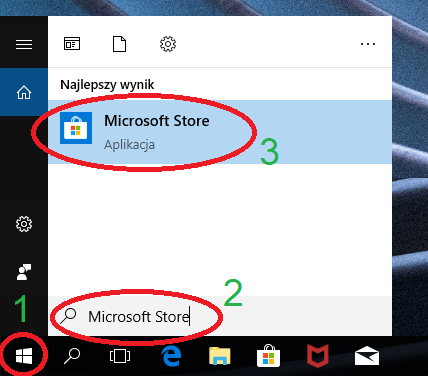

Za pomocą wyszukiwarki w prawym górnym rogu wyszukaj frazę **python**, wciśnij `ENTER`.


Z wyników wyszukiwania, z kategorii **Apki** wybierz najnowszą wersję Pythona (**bez Beta!**). W momencie pisania instrukcji jest to Python 3.7.

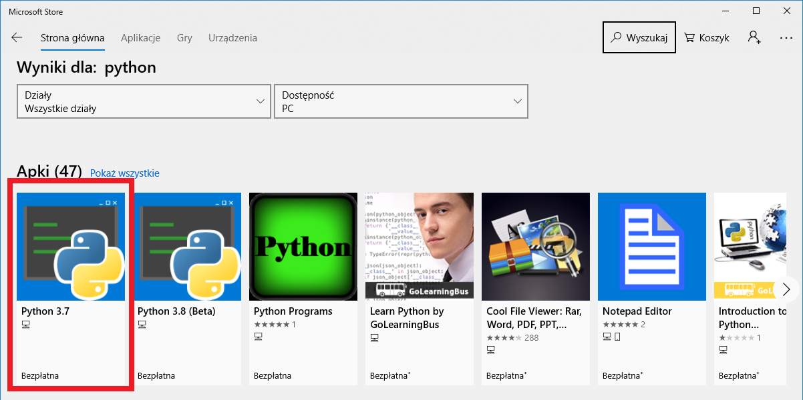

Kliknij **Pobierz**. W przypadku braku konta *Microsoft* na używanym przez nas komputerze zostaniemy zapytani o chęć zalogowania, nie musimy tego robić i klikamy *Nie, dziękuję*.

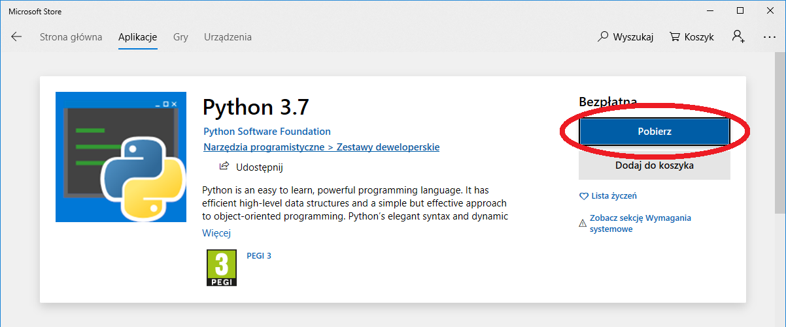

Czekamy na zakończenie procesu instalacji i zamykamy *Microsoft Store*.

### Linux Ubuntu 18.04

W Ubuntu od wersji 18.04 Python 3 jest zainstalowany domyślnie razem z instalacją systemu. Konieczne jest jedynie instalacja menadżera pakietów dla Pythona 3 czyli *pip3*.

W celu instalacji otwórz terminal wciskając na klawiaturze kombinację klawiszy: `Ctrl + Alt + T`. Następnie wykonaj następujące komendy (przepisz/wklej i zatwierdź wciskając `ENTER`):

1. Zacznij od zaktualizowania listy pakietów (przy wykonaniu pierwszej komendy pojawi się pytanie o hasło użytkownika, należy je wpisać i zatwierdzić klawiszem `ENTER`):

```shell
sudo apt update
```

2. Zainstaluj menadżer *pip* dla Python 3:

```shell
sudo apt install python3-pip
```

### macOS

Możliwa jest instalacja samego pakietu Python ze strony python.org, zaleca się jednak zainstalowanie wersji z repozytorium MacPorts, wraz ze środowiskiem XCode oraz konsolowymi narzędziami programistycznymi, według poniższej instrukcji.

#### Jeśli nie masz jeszcze XCode:

1. Korzystając z App Store zainstaluj środowisko programistyczne *XCode*: [link do aplikacji](https://apps.apple.com/us/app/xcode/id497799835). Wymagane jest darmowe konto Apple ID.

2. Uruchom po raz pierwszy program Xcode (poprzez Launchpad lub Spotlight), co spowoduje zainstalowanie dodatkowych narzędzi. Podaj hasło użytkownika, zamknij *XCode* po zakończonej instalacji i przejdź do kroku 3.

#### Jeśli masz już XCode:

3. Uruchom aplikację Terminal (poprzez Launchpad lub Spotlight).

W otwartym terminalu wykonaj następującą komendę (przepisz/wklej i zatwierdź wciskając `ENTER`):

```shell
xcode-select --install
```

Wyraź zgodę na instalację oprogramowania, po zakończeniu zamknij terminal.

4. Pobierz instalator najnowszej wersji MacPorts dla posiadanej wersji systemu ze strony https://github.com/macports/macports-base/releases/.
Wersję zainstalowanego systemu możesz sprawdzić otwierając menu Apple &rarr; *Ten Mac*. Przykładowo dla systemu macOS 10.14 Mojave, jest to w chwili pisania instrukcji plik *MacPorts-2.6.1-10.14-Mojave.pkg*. Uruchom instalator i pozostaw domyślne opcje, wybierając *Continue* na każdym z ekranów. Autoryzuj hasłem użytkownika, kiedy instalator o to poprosi.

5. Otwórz ponownie aplikację terminal. Wykonaj kolejno polecenia, zatwierdzając klawiszem `ENTER`. Przy wykonaniu pierwszej komendy pojawi się pytanie o hasło użytkownika, należy je wpisać (wpisywane znaki nie będą wyświetlane w konsoli) i zatwierdzić `ENTER`.

Zaktualizuj bazę pakietów MacPorts:
```shell
sudo port selfupdate
```

Zainstaluj Python w wersji 3.7:
```shell
sudo port install python37 py37-pip pip_select
```
Zapytany zatwierdź instalację klawiszem `ENTER`.

Wybierz Python 3.7 jako domyślną wersję Python 3 w systemie:
```shell
sudo port select --set python3 python37
```
oraz menadżer *pip* w wersji 3.7 jako domyślny dla polecenia `pip3`:
```shell
sudo port select --set pip3 pip37
```

## Instalacja pakietów dla Python 3

Czysta instalacja Pythona dostarcza jedynie podstawowej funkcjonalności języka. Pomimo, że jest to rozbudowany i wielozadaniowy język skryptowy możliwe jest rozszerzenie jego funkcjonalności poprzez instalację pakietów. Istnieje cały szereg pakietów, począwszy od pakietu automatyzującego wyświetlanie pasków postępu ([tqdm](https://github.com/tqdm/tqdm)), na narzędziach do uczenia głębokich sieci neuronowych ([PyTorch](https://pytorch.org/)) skończywszy.

Podczas zajęć wykorzystywać będziemy następujące pakiety:

- [NumPy](https://numpy.org/) - podstawowy pakiet do obliczeń, zawiera między innymi operacje macierzowe,
- [Pandas](https://pandas.pydata.org/) - zaawansowana biblioteka struktur danych oparta na NumPy,
- [Matplotlib](https://matplotlib.org/) - pakiet rysujący wykresy,
- [Jupyter](https://jupyter.org/) - interaktywne środowisko programistyczne i obliczeniowe.

Instalacja pakietów zazwyczaj wykonywana jest za pomocą menażera pakietów dla Pythona czyli *pip*. Wywołanie menadżera pakietów odbywa się z linii poleceń. Zainstaluj powyższe pakiety korzystając, zależnie od systemu, z poniższej instrukcji:

### Microsoft Windows 10 oraz Linux Ubuntu

1. Otwórz okno linii poleceń:

* Windows 10: na klawiaturze wciśnij kombinację klawiszy: `Windows + R`. Pojawi się okienko *Uruchamianie*. Wpisz na klawiaturze frazę **cmd** (1), a następnie zatwierdź wciskając `ENTER` lub **OK** (2).

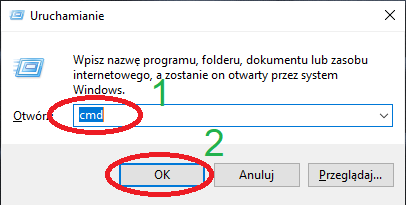

* Linux Ubuntu: wciśnij na klawiaturze kombinację klawiszy: `Ctrl + Alt + T`.

2. W otwartym terminalu wykonaj następujące komendy (przepisz/wklej i zatwierdź wciskając `ENTER`):

Wykonaj aktualizację menadżera pakietów *pip*:

```shell
pip3 install --upgrade pip
```

Zainstaluj wykorzystywane na zajęciach pakiety:

```shell
pip3 install numpy pandas matplotlib jupyter
```

### macOS

Menadżer *pip* z pakietu MacPorts domyślnie próbuje instalować pakiety globalnie (dla całego systemu). O ile możliwe jest wymuszenie instalacji w katalogu domowym użytkownika (parametrem `--user`), pakiety te są również dostępne bezpośrednio z poziomu MacPorts i warto skorzystać z tej opcji:

1. Otwórz aplikację Terminal.

2. Wykonaj polecenie:

```shell
sudo port install py37-numpy py37-pandas py37-matplotlib py37-jupyter
```
Podaj hasło użytkownika, jeśli zostaniesz o to poproszony. Zatwierdź instalację dodatkowych wymaganych pakietów klawiszem `ENTER`.

## Instalacja PyCharm

PyCharm jest integrowanym środowiskiem programistycznym dla języka Python stworzonym przez firmę JetBrains. Jest to oprogramowanie wieloplatformowe, którego można używać na systemach Windows, GNU/Linux i macOS.

### Microsoft Windows 10

1. Wejdź na stronę: [https://www.jetbrains.com/pycharm/download/#section=windows](https://www.jetbrains.com/pycharm/download/#section=windows)

2. Ściągnij wersję *Community* klikając czarny przycisk **Download**:

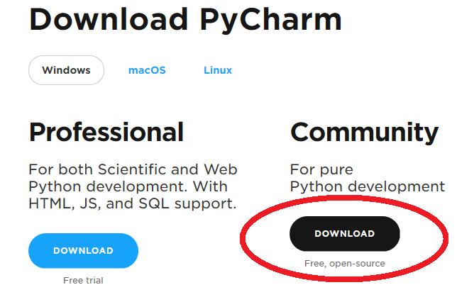

3. Uruchom ściągnięty instalator. Przeprowadź instalację z domyślnymi ustawieniami.

### Linux Ubuntu

W celu instalacji otwórz terminal wciskając na klawiaturze kombinację klawiszy: `Ctrl + Alt + T`. Następnie wykonaj następującą komendę (przepisz/wklej i zatwierdź wciskając `ENTER`):

```shell
sudo snap install pycharm-community --classic
```

### macOS

1. Wejdź na stronę: [https://www.jetbrains.com/pycharm/download/#section=mac](https://www.jetbrains.com/pycharm/download/#section=mac)

2. Ściągnij wersję *Community* klikając czarny przycisk **Download**.

3. Otwórz pobrany obraz dysku i skopiuj aplikację *PyCharm CE* do katalogu *Applications*.

## Pierwsze uruchomienie PyCharm i konfiguracja środowiska

Przy pierwszym uruchomieniu PyCharm, bez względu na wykorzystywany system operacyjny, zostaniemy zapytani o chęć zaimportowania ustawień środowiska. Wybieramy **Do not import settings** (1), a następnie **OK** (2):

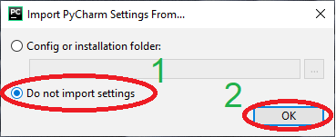

Potwierdzamy licencję (1) i klikamy **Contuniue** (2):

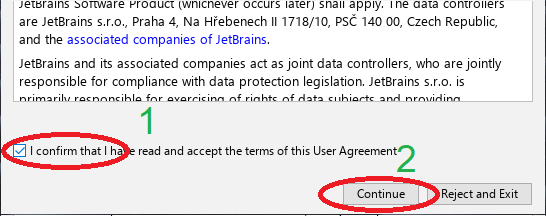

Decydujemy czy chcemy pomagać w rozwijaniu PyCharm poprzez przesyłanie raportów . Wybieramy **Send Usage Statistics** lub **Don't send**:

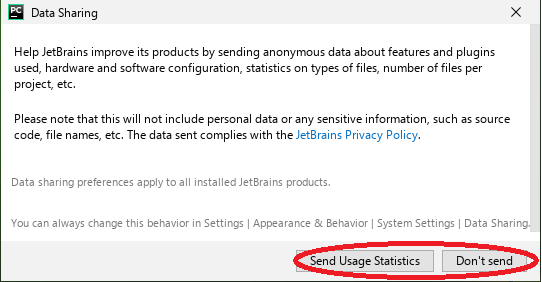

Następnie mamy możliwość dostosowania interfejsu użytkownika do własnych preferencji. Można wykonać zmiany. Domyślne ustawienia uzyskujemy klikając **Skip Remaining and Set Defaults**:

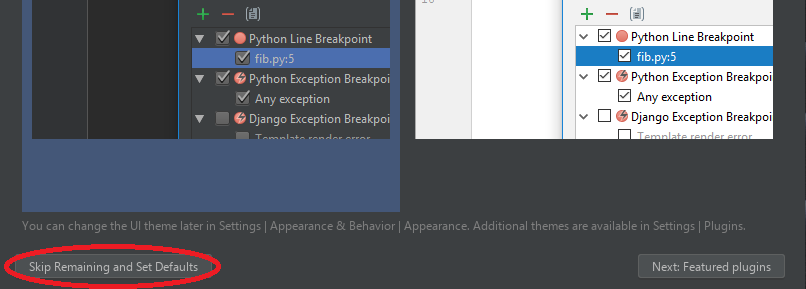

W kolejnych krokach skonfigurujemy domyślny interpreter Python 3 wykorzystywany przy tworzeniu nowych projektów przez PyCharm. Kliknij **Configure** (1), a następnie **Settings** (2):

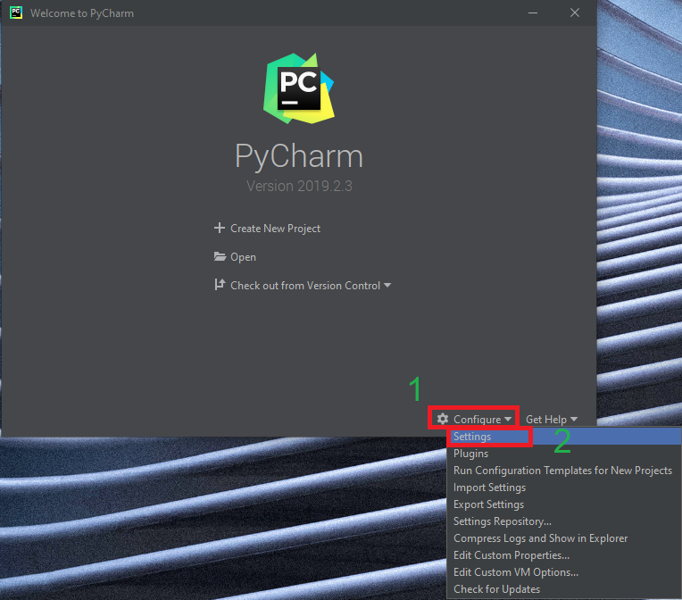

Przejdź do zakładki **Project Interpreter** (1), a następnie kliknij koło zębate w prawym górnym rogu (2):

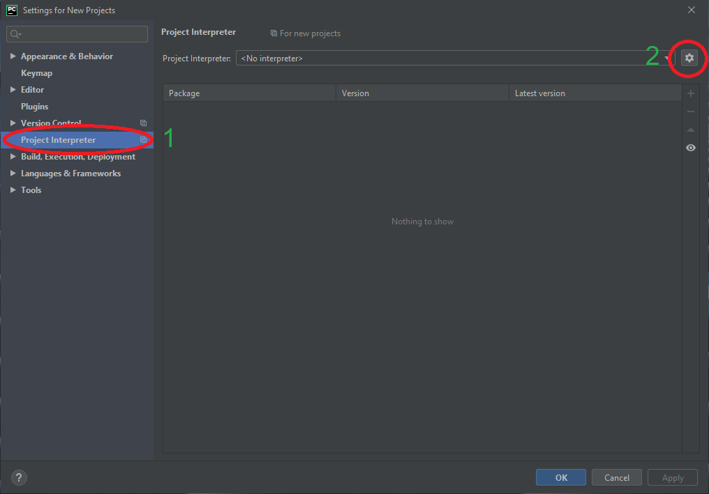

Z wyskakującej listy wybieramy **Add...**:

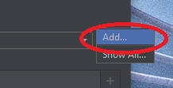

Wybieramy zakładkę **System Interpreter** (1) i zatwierdzamy przyciskiem **OK** (2):

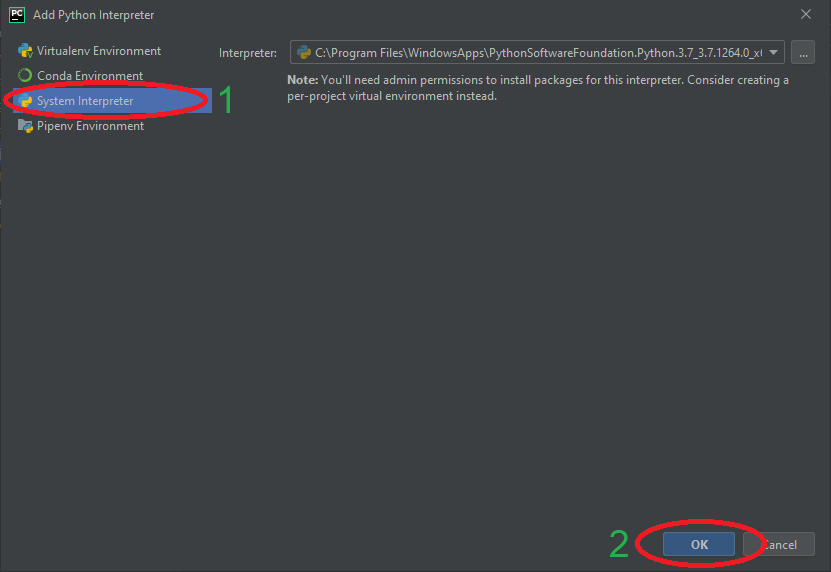

Po chwili interpreter zostanie dodany i zostanie wyświetlona pełna lista zainstalowanych dla niego pakietów. Zatwierdzamy wciskając **OK**:

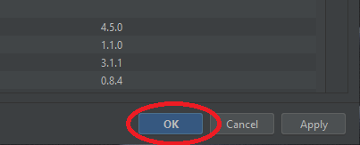

---

Autorzy: *Tomasz Mańkowski*, *Jakub Tomczyński*
