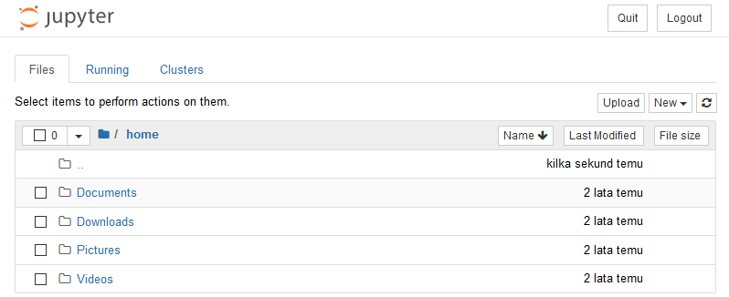
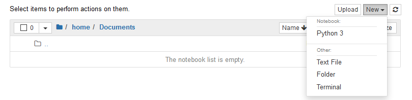
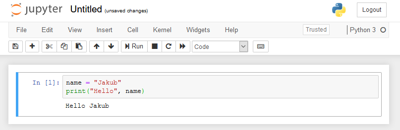
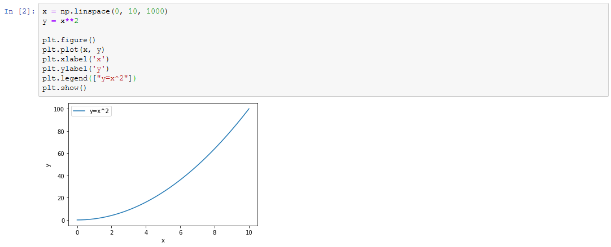

# 10 - Obliczenia numeryczne, Jupyter

## Jupyter Notebook

Jupyter Notebook to wygodne środowisko do tworzenia dokumentów zawierających wykonywalny kod źródłowy, opisy tekstowe, równania czy wizualizacje, najczęściej wykorzystywane w połączeniu z językiem Python. Taka forma pozwala na łatwe testowanie fragmentów kodu, sprawdzanie rozwiązań i czytelną prezentację wyników. Obsługa narzędzia odbywa się przez przeglądarkę internetową.

Po zainstalowaniu pakietów zgodnie z instrukcją *Instalacja Python na domowym komputerze*, aby uruchomić środowisko *Jupyter Notebook* otwórz terminal systemowy (w systemie Windows: `Win`+`R`, wpisz `cmd`):

```bash
jupyter notebook
```

Jeśli korzystasz z systemu *macOS*, a pakiety instalujesz z repozytorium *macports*, polecenie ma następującą postać:

```bash
jupyter-3.7 notebook
```

Uruchomienie powyższego polecenia spowoduje uruchomienie *serwera* Jupyter w terminalu i jednocześnie otwarcie domyślnej przeglądarki internetowej z interfejsem środowiska. Nie zamykaj okna terminala, pozostaw je uruchomione w tle. Zwróć uwagę na adres w przeglądarce - adresem serwera jest `localhost` czyli komputer lokalny. Możliwa jest również praca zdalna - serwer może być uruchomiony na maszynie o dużej mocy obliczeniowej, podczas gdy pracujemy w innym miejscu np. na komputerze przenośnym czy nawet urządzeniu mobilnym. Cały program będzie wykonywany na serwerze w tzw. *kernelu*, a nasz komputer wyświetli jedynie jego wyniki.

**Pamiętaj, że Jupyter Notebook to tylko środowisko** - składnia i zasady języka Python pozostają niezmienione, zatem cała Twoja wiedza z poprzednich zajęć będzie mieć tu zastosowanie.

### Interfejs

Po uruchomieniu Jupytera, w przeglądarce powinnna załadować się strona podobna do poniższej, zawierająca przeglądarkę plików:



Przejdź do folderu, w którym chcesz pracować, np `Documents`. Utwórz nowy *notatnik* klikając *New*, a następnie wybierając kernel - *Python 3*:



Notatnik otworzy się w nowej karcie przeglądarki. Będzie zawierał puste pole tekstowe - wklej do niego poniższy kod źródłowy, a następnie wykonaj go naciskając `Ctrl` + `Enter`.

```python
name = "Jakub"
print("Hello", name)
```

Powinieneś uzyskać następujący wynik:



Możesz zapisać swój notatnik pod stosowną nazwą wybierając `File` → `Save as...` (**Uwaga** - mowa o menu w obrębie interfejsu Jupytera, a nie o pasku menu przeglądarki). Jupyter będzie cyklicznie tworzył kopie zapasowe, ale warto pamiętać o ręcznym zapisywaniu kodu. Notatnik przechowywany jest w pliku z rozszerzeniem `ipynb`.

Pole tekstowe, do którego został wklejony kod to *komórka* (ang. *cell*). Notatnik może być zbudowany z wielu takich komórek, z których każda może zostać uruchomiona oddzielnie. Komórki mogą zawierać kod źródłowy przeznaczony do uruchomienia (*code cell*) lub tekst sformatowany wraz z grafikami, tabelami itp. (*Markdown cell*). W ramach zajęć będziemy korzystać głównie z komórek z kodem źródłowym. Komórka taka może zawierać wiele linii kodu i koncepcyjnie powinna odpowiadać za jedną czynność - np. wczytanie danych, poszczególne etapy ich przetwarzania czy prezentację wyników. Wszystkie komórki współdzielą jeden **interpreter** Pythona - oznacza to, że dane zapisane do zmiennych w jednej komórce można ponownie wykorzystać w kolejnych.

Dodaj kolejną komórkę przyciskiem **+** w pasku narzędziowym lub naciskając `Alt` + `Enter`. Umieść w niej poniższy kod źródłowy i uruchom (`Ctrl` + `Enter`):

```python
print(name, "has", len(name), "letters")
```

Zwróć uwagę na napisy umieszczone po lewej stronie od komórek (`In [1]:`, `In [2]:` itd.). Oznaczają one kolejność, w jakiej zostały wykonane. Dodaj trzecią komórkę i umieść w niej poniższy kod:

```python
name = "Joaquin"
```

Wykonaj komórkę trzecią, a następnie podświetl komórkę drugą (możesz do niej przejść klawiszami kursora na klawiaturze bądź użyć myszy) i wykonaj ponownie jej zawartość. Jaki jest efekt?

**Uwaga!** Oczywiście kod powinien być pisany w notatniku z założeniem, że komórki wykonywane są kolejno, od góry do dołu - analogicznie do zwykłego pliku źródłowego. Jednak pracując nad nowym programem czy algorytmem często spotkasz się z sytuacją, gdzie poprawek i ponownego uruchomienia wymaga tylko jedna komórka, a uruchomienie całego kodu byłoby np. kosztowne czasowo. Jupyter daje możliwość poprawienia i uruchomienia pojedynczych komórek, jednak należy mieć na uwadze czy w zmiennych w interpreterze znajduje się to, czego oczekujemy.

Wszystkie operacje edycji struktury notatnika można wykonywać z menu graficznego, jednak przy częstym używaniu warto zapoznać się ze skrótami klawiszowymi dla przyspieszenia obsługi. Podczas obsługi interfejs ma dwa tryby - *command mode* (niebieski pasek po lewej od aktywnej komórki) oraz *edit mode* (zielony pasek), aktywowane odpowiednio klawiszami `Escape` oraz `Enter`.

Najprzydatniejsze skróty to:

* w *command mode*:
    * `A`/`B` - wtaw komórkę powyżej/poniżej bieżącej
    * `D`, `D` (dwukrotne naciśnięcie) - usunięcie bieżącej komórki
    * `Z` - cofnięcie usunięcia
* w *edit mode*:
    * `Tab` - autouzupełnienie (przy pierwszym użyciu może działać z opóźnieniem)
    * `Ctrl` + `Enter` - uruchom komórkę
    * `Shift` + `Enter` - uruchom komórkę i przejdź do komórki poniżej
    * `Alt` + `Enter` - uruchom komórkę i wstaw nową poniżej
    * `Ctrl` + `Shift` + `-` - podziel komórkę na dwie (w miejscu kursora)

Pełną ściągę ze skrótami można znaleźć tutaj: https://www.cheatography.com/weidadeyue/cheat-sheets/jupyter-notebook/pdf_bw/

Zamknij swój pierwszy notatnik wybierając polecenie `File` → `Close and Halt`, co spowoduje zatrzymanie kernela na serwerze i zamknięcie strony.

## NumPy

NumPy to bardzo popularna biblioteka dodająca do Pythona możliwość prowadzenia obliczeń na macierzach w wygodny sposób.

Utwórz nowy notatnik, zapisz go pod stosowną nazwą, np. `hello_numpy`. W pierwszej komórce zaimportuj bibliotekę NumPy poleceniem:

```python
import numpy as np
```

Powyższe polecenie różni się od wywołań `import` używanych na poprzednich zajęciach - biblioteka została zaimportowana pod nazwą `np` dla skrócenia kodu. Oznacza to, że do jej funkcji będziemy się odwoływać przez `np.nazwa_funkcji`, a nie `numpy.nazwa_funkcji`. Podana konwencja (`np` jako alias dla `numpy`) jest ogólnie przyjętym standardem. Nie należy tworzyć własnych skrótów, ponieważ prowadzi to do powstawania nieczytelnego kodu.

**Hint:** pierwsza komórka często służy tylko wczytaniu wymaganych bibliotek. Kolejne bloki kodu z zadań do wykonania w instrukcji, a także zadania do samodzielnego wykonania umieszczaj w oddzielnych komórkach.

### Tworzenie macierzy

Macierze numpy najprościej utworzyć na podstawie *listy* funkcją `np.array()`. Dla 1-wymiarowej macierzy (wektora) dostęp do indywidualnych elementów jest podobny jak w przypadku Pythonowej listy. Pamiętaj, że w przeciwieństwie do MATLABa, indeksowanie elementów zaczyna się od 0:

```python
a = np.array([-1, 3.14, 0]) # tworzy 1-wymiarowa macierz (wektor)
print("Wymiary:", a.shape)
print(a)
a[0] = 5
print(a)
```

Analogicznie możliwe jest stworzenie dwuwymiarowej macierzy na podstawie listy list-wierszy:

```python
b = np.array([[10, 20, 30], [41, 51, 61]]) # tworzy macierz 2 x 3
print("Wymiary:", b.shape)
print("Liczba wierszy:", b.shape[0])
print("Liczba kolumn:", b.shape[1])
print("Różne elementy:", b[0, 0], b[0, 1], b[1, 0])
```

Często używane typy macierzy (np. jednostkową, wypełnione zerami czy stałą liczbą) można uzyskać poniższymi funkcjami: 

```python
c = np.zeros((2,2))         # macierz zer
print("zeros:")
print(c)
print()

d = np.ones((1,2))          # macierz jedynek
print("ones:")
print(d)
print()

e = np.full((2,2), 7)       # macierz wypelniona stałą
print("full:")
print(e)
print()

f = np.eye(4)               # macierz jednostkowa
print("eye:")
print(f)
print()

g = np.random.random((2,3)) # macierz z losowymi elementami z przedziału <0...1>
print("random:")
print(g)
```

Metoda `shape` macierzy zwraca *krotkę*, którą na bieżące potrzeby możesz traktować tak samo jak listę, odwołując się do jej elementów nawiasami kwadratowymi. Funkcje `zeros`, `ones` itp. przyjmują jako pierwszy argument również krotkę - jej utworzenie różni się od listy tylko typem nawiasów (okrągłe zamiast kwadratowych).

Często wymagane jest stworzenie wektora o równomiernym rozkładzie. Służą do tego funkcje `np.arange(start, stop, step)` oraz  `np.linspace(start, stop, num)`:

```python
x = np.arange(10, 30, 5)           # wektor od 10 do 30 (przedział prawostronnie otwarty), z krokiem 5
print("arange:")
print(x)
print()

y = np.linspace(0, 2*np.pi, 10)    # wektor od 0 do 2*pi (przedział obustronnie domknięty), o 10 elementach
print("linspace:")
print(y)
```

---

#### :hammer: :fire: Zadanie :fire: :hammer:

* Stwórz zmienną `n`, przypisz jej wartość całkowitą, np. 4.
* Utwórz losową macierz o wymiarach `n` x `n`, wyświetl ją.
* Korzystając z pętli `for` wyświetl elementy leżące na przekątnej wylosowanej macierzy.

---

### Podstawowe operacje arytmetyczne i logiczne

Podstawowe operacje matematyczne (dodawanie, odejmowanie, mnożenie, dzielenie, potęgowanie) wykonywane są z użyciem standardowych operatorów **na każdym elemencie** macierzy, wynik zwracany jest jako nowa macierz. Wejściowie macierze muszą mieć zgodne wymiary, jednym z operandów może być skalar. W bibliotece NumPy dostępne są również podstawowe funkcje matematyczne, np. `np.sin`, `np.sqrt` itd., które również działają poprawnie dla macierzy. Pełna lista funkcji wraz z opisem dostępna jest w dokumentacji: https://docs.scipy.org/doc/numpy/reference/routines.math.html

```python
a = np.array([20, 30, 40, 50])
b = np.arange(0, 4)
c = a - b
print("odejmowanie:")
print(a - b)

print("potęgowanie przez skalar:")
print(b**2)

print("wartość funkcji 10*sin(a):")
print(10*np.sin(a))
```

W odróżnieniu od np. MATLABa, operator `*` na macierzach również wykonuje operację per-element. Do mnożenia macierzy służy operator `@`:

```python
A = np.array([[1, 0],
              [0, 1]])
B = np.array([[2, 0],
              [3, 4]])
              
print("mnożenie po elementach:")
print(A * B)
print()

print("mnożenie macierzy:")
print(A @ B)
```

Na wektorach i macierzach można wykonywać również operacje logiczne (porównania), wykorzystując operatory takie jak `<`, `>`, `<=`, `>=`, `==`, `!=`. Wynikiem jest macierz logiczna o tym samym rozmiarze:


```python
print("porównanie macierzy ze skalarem:")
print(B <= 3)
print()

print("porównanie macierzy z macierzą:")
print(A == B)
print()
```

---

#### :hammer: :fire: Zadania :fire: :hammer:

1. Stwórz macierz losową o 4 wierszach i 3 kolumnach zawierającą elementy z przedziału <0..100> (**podpowiedź**: funkcja `np.random.random` generuje macierz z elementami z zakresu <0..1>)

2. Utwórz wektor zawierający wartości kątów: 0°, 30°, 45° i 90°. Wyznacz jedną operacją wartości funkcji sinus dla podanych kątów. **Hint:** 

3. Wygeneruj wektor zawierający kolejne potęgi liczby 2 (z wykładnikiem od 0 do 10, zwiększanym co 1)

---

### Indeksowanie macierzy

Fragmenty jednowymiarowych macierzy (wektorów) można wybierać identycznie jak fragmenty Pythonowych list, za pomocą zakresów podawanych w nawiasach kwadratowych, jako pojedynczy indeks bądź w formacie `od:do` lub `od:do:krok`.

```python
a = np.arange(10)**3
print(a)
print(a[2])
print(a[2:5])
print(a[::2))
```

Dla dwu- i wielowymiarowych macierzy należy podać w nawiasach jeden zakres dla każdego wymiaru. Możliwe jest podanie wartości `:` oznaczającej pełny zakres w danym wymiarze. Pamiętaj, że zakresy opisują przedział indeksów prawostronnie otwarty.

```python
B = np.array([[1], [2], [3], [4]]) @ np.array([[10, 20, 30, 40]])
print("macierz wejściowa:")
print(B)
print("wiersze 0, 1, 2 z kolumny 1:")
print(B[0:3, 1])
print("cały drugi wiersz:")
print(B[2, :])
print("fragment macierzy:")
print(B[0:3, 0:3])
```

Do indeksowania można również użyć macierzy logicznej, będącej np. wynikiem porównania:

```python
a = np.random.random(10)
print("a =", a)
b = a[a > 0.7] # wybierz z wektora a elementy większe niż 0.7
print("b =", b)
```


**Uwaga!** wycięty fragment macierzy w większości przypadków nie jest nową macierzą w pamięci, tylko *widokiem* na oryginalną macierz. Aby wymusić utworzenie nowej macierzy uniknąć możesz użyć metody `.copy()`:

```python
C = B[1:3, 1:3]
C[0, 0] = -3.14
print(B) # oryginalna macierz została zmodyfikowana

D = np.ones((4, 5))
E = D[1:3, 1:3].copy()
E[0, 0] = -3.14
print(D) # oryginalna macierz nie została zmodyfikowana
```

## Wykresy - Matplotlib

Matplotlib to popularna biblioteka służąca do generowania wykresów w Pythonie. Jest ściśle powiązana z NumPy, a jej interfejs programistyczny jest zbliżony do tego używanego w MATLABie. Wróć do pierwszej komórki, dodaj do niej komendę importującą bibliotekę i uruchom ją:

```python
import matplotlib.pyplot as plt
```

Wróć do końca notatnika i wklej w nowej komórce poniższe polecenia:

```python
x = np.linspace(0, 10, 1000)
y = x**2

plt.figure() # tworzy nowy wykres
plt.plot(x, y)
plt.xlabel('x')
plt.ylabel('y')
plt.legend(["y=x^2"])
plt.show() # powoduje wyświetlenie wykresu
```

Powinieneś uzyskać następujący efekt:



Matplotlib ma wiele interfejsów rysowania wykresu - domyślnie w Jupyterze wykresy będą generowane pod bieżącą komórką, przy uruchomienium mp. z linii poleceń lub z PyCharma pojawią się w nowym oknie.

Zwróć uwagę, że funkcja `legend` przyjmuje **listę** etykiet - nawet jeśli do opisania jest tylko jeden wykres.

W odróżnieniu od MATLABa, kolejne wywołania funkcji `plot` nie będą nadpisywać istniejącej zawartości. Formatowanie wykresu jest bardzo zbliżone do składni w MATLABie - pełny opis znajdziesz w dokumentacji: https://matplotlib.org/3.1.1/api/_as_gen/matplotlib.pyplot.plot.html

```python
x = np.linspace(0, 10, 1000)

plt.figure()
plt.plot(x, 20*np.sin(x), 'r')
plt.plot(x[::50], x[::50]**2, '^k')
plt.plot(x, 5*np.cos(x), '--g')
plt.legend(["y=sin(x)","y=x^3","y=sqrt(x)" ])
plt.show()
```

Możliwe jest również podanie do funkcji `plot` macierzy jako wartości y, każda kolumna jest wtedy traktowana jako oddzielny przebieg:

```python
plt.figure()
plt.plot(np.random.random((30, 2)))
plt.show()
```

A także rysowanie wykresów złożonych z podwykresów:

```python
t = np.linspace(-np.pi, np.pi, 100)
plt.figure()
plt.subplot(1, 2, 1)
plt.plot(t, np.sin(t))
plt.subplot(1, 2, 2)
plt.plot(t, np.cosh(t))
plt.show()
```

---

## Zadanie końcowe :fire: :hammer:

Krzywa gaussa opisana jest równaniem:


1. Wygeneruj na wspólnym wykresie serię krzywych Gaussa o parametrach


dla wartości *x* od -5 do 5, z krokiem 0.1.

W/w parametry przechowaj w programie w wygodny sposób, np. jako listę słowników.

2. Zmodyfikuj program tak, aby zapisywał wartości funkcji dla każdej krzywej we wspólnej macierzy, gdzie kolumnom odpowiadają kolejne krzywe, a w wierszom kolejne próbki. Pamiętaj o przygotowaniu macierzy o odpowiednim rozmiarze. Wykreśl wykresy pojedynczym wywołaniem funkcji `plt.plot()`.

3. Dodaj legendę. Listę opisów do legendy wygeneruj automatycznie na podstawie zmiennej przechowującej parametry krzywych. Opisy powinny zawierać wartości parametrów zaprezentowane w czytelny sposób.

4. Dodaj do wykresu czwartą krzywą, narysowaną linią przerywaną i kolorem czerwonym, reprezentującą maksymalną wartość dla danego argumentu *t* ze wszystkich składowych funcji. 


---

## Zadanie domowe :home:

1. Przetestuj działanie poznanych dzisiaj funkcji w środowisku PyCharm:

    * Utwórz skrypt, zaimportuj w nim niezbędne biblioteki.
    
    * Przygotuj wektor czasu *t* od 0 do 2π, z krokiem 0.01.
    
    * Wykreśl na wspólnym wykresie, w pętli, serię trzech krzywych Lissajous, opisanych zestawem równań: 


    * Przyjmij parametry *A*, *B* i *a* równe 1, parametr *b* ustal inny dla każdej z krzywych ze zbioru [2, 4, 6].
    
    * Dodaj do wykresu legendę zawierającą wartość parametru *b* dla każdej z krzywych, opisy osi oraz tytuł.

2. Napisz program wyświetlający zmiany w kursach walut na przestrzeni lat. Możesz wykorzystać środowisko PyCharm lub Jupyter Notebook.

    * Korzysytając z biblioteki `requests` i API na stronie *exchangeratesapi.io* pobierz kursy walut z 1 stycznia każdego roku, począwszy od 2000 do 2019.

    Adres zapytania zwracający kurs z danego dnia w formacie JSON:
    
    `https://api.exchangeratesapi.io/YYYY-MM-DD?base=PLN`

    * Odczytaj z pobranego JSON-a kursy PLN w stosunku do USD, EUR i GBP z każdego roku i umieść jako elementy w macierzy `np.array`, gdzie kolumny odpowiadają walutom, a wiersze kolejnym datom.

    * Wykreśl wszystkie kursy na wspólnym wykresie w różnych kolorach, dodaj opisy osi i legendę. Pamiętaj o wyświetleniu lat na osi x.

 
---

Autor: *Jakub Tomczyński*
