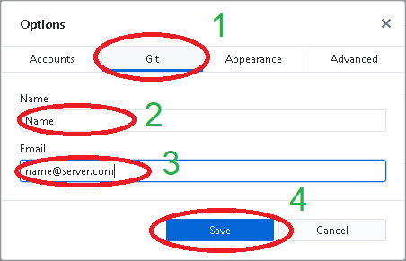
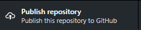

# 12 - System kontroli wersji - Git

## System kontroli wersji

System kontroli wersji (ang. *version/revision control system*) jest to oprogramowanie służące do śledzenia zmian (najczęściej w kodzie źródłowym) oraz pomocy programistom w łączeniu zmian dokonanych przez wiele osób w różnych momentach ([http://pl.wikipedia.org/wiki/System_kontroli_wersji](http://pl.wikipedia.org/wiki/System_kontroli_wersji)). Jednym z popularnych rozproszonych systemów kontroli wersji jest Git stworzony przez Linusa Torvaldsa na potrzeby rozwoju jądra Linuxa ([http://pl.wikipedia.org/wiki/Git_(oprogramowanie)](http://pl.wikipedia.org/wiki/Git_(oprogramowanie))).

Dodatkowe materiały:

- Strona projektu git: [http://git-scm.com/](http://git-scm.com/)
- Darmowa książka: [http://git-scm.com/book](http://git-scm.com/book)
- Tutorial GitHub: [https://guides.github.com/](https://guides.github.com/)

## Serwis GitHub i program GitHub Desktop

[GitHub](https://github.com/) jest serwisem hostingowym wykorzystującym system kontroli wersji Git. [GitHub](https://github.com/) jest bardzo popularnym serwisem wśród społeczności open-source pozwala na tworzenie zarówno publicznych jak i prywatnych repozytoriów.

---

#### :hammer: :fire: Zadanie :fire: :hammer:

Jeżeli nie masz konta na [GitHub](https://github.com/) utwórz nowe konto. Rozważnie wybierz alias pod którym będziesz widoczny w serwisie. Wszystkie treści publikowane na GitHub, włącznie z projektami i kodem, są domyślnie publiczne. Profil GitHub może być Twoją wizytówką!

---

Zwyczajowo obsługa systemu kontroli wersji odbywa się za pomocą programu `git` wywoływanego z linii poleceń. Istnieje jednak szereg GUI ułatwiających pracę z programem git. Jednym z nich jest GitHub Desktop. Celem instalacji programu na domowym komputerze można go pobrać ze strony: [https://desktop.github.com/](https://desktop.github.com/).

Jeżeli jest to pierwsze uruchomienie programu zostaniesz poproszony o zalogowanie się swoim kontem GitHub. W przeciwnym wypadku otwórz menu **File** (1) &rarr; **Options..** (2) (jeśli menu nie jest widoczne, możesz użyć skrótu *Ctrl*+*,*):


Następnie wybierz zakładkę **Accounts** (1) i zaloguj program *GitHub Desktop* do serwisu *GitHub* klikając **Sign in** (2), konieczne będzie podanie danych do logowania:


---

#### :hammer: :fire: Zadanie :fire: :hammer:

1. Zaloguj *GitHub Desktop* w serwisie *GitHub*.
2. **Pamiętaj aby po skończonych laboratoriach wylogować się w programie!** Operację tę wykonasz w tym samym menu klikając **Sign Out**.

---

Warto upewnić się, że program GitHub Desktop ma odpowiednio ustawioną tożsamość użytkownika (w laboratorium z programu korzysta wiele osób). Dzięki temu wgrywane do repozytorium zmiany będą markowane naszą nazwą użytkownika i adresem e-mail. W tym celu otwórz menu **File** (1) &rarr; **Options..** (2):


Następnie w zakładce **Git** (1) wyedytuj nazwę (2) oraz adres email (3). Zatwierdź klikając **Save** (4):



---

#### :hammer: :fire: Zadanie :fire: :hammer:

Wyedytuj tożsamość w programie *GitHub Desktop* zgodnie z powyższą instrukcją.

---

## Moje pierwsze repo

### Tworzenie repozytorium

*GitHub Desktop* służy do zarządzania lokalnymi repozytoriami znajdującymi się na dysku komputera. Pierwszym krokiem umożliwiającym nam pracę jest utworzenie lokalnego repozytorium w folderze naszego projektu. W tym celu klikamy:


Następnie nadajemy nazwę swojemu repozytorium (1) (nie używaj w nazwie repozytorium "polskich" znaków!) i wybierz lokalizację (2), w której zostanie utworzony nasz projekt. Następnie wybierz konfigurację **Git Ignore** (3). Warto wskazać używany język, np. Python. Utwórz lokalne repozytorium klikając *Create Repository* (4).


---

#### :hammer: :fire: Zadanie :fire: :hammer:

1. Utwórz nowe repozytorium o nazwie: *hello-git-nazwisko* (nie używaj w nazwie repozytorium "polskich" znaków!). Jako konfigurację *Git ignore* wybierz *Python*.
2. Obejrzyj zawartość folderu z utworzonym repozytorium. Zauważ, że pojawił się ukryty folder *.git*. Zastanów się co zawiera?
3. Dowiedz się czym jest plik *.gitignore*

---

W górnym lewym rogu znajduje się rozwijana lista repozytoriów:


Z niej masz możliwość wybrania aktualnego repozytorium z którym pracujesz. W tym momencie nasze repozytorium istnieje tylko na lokalnym komputerze. Należy umieścić je na serwerze GitHub. W tym celu klikamy:



Jeżeli dotychczas nie wykonaliśmy logowania programu do serwisu GitHub, zostaniemy o to poproszeni.

Jeśli nie chcemy, aby repozytorium było publiczne, pozostawiamy zaznaczone pole *Keep this code private* (1). Zachęcamy do tworzenia publicznych repozytoriów i dzielenia się swoją pracą! Darmowe konto w portalu GitHub pozwala na tworzenie prywatnych repozytoriów współdzielonych maksymalnie przez 3 użytkowników. Potwierdzamy chęć opublikowania repozytorium (2) i czekamy na wysłanie danych na serwer.


---

#### :hammer: :fire: Zadanie :fire: :hammer:

1. Opublikuj swoje repozytorium jako publiczne.
2. Przejdź do swojego profilu na [GitHub.com](https://github.com/) i obejrzyj utworzone repozytorium.

---

### Pierwszy commit

Nadajmy sens naszemu pierwszemu repozytorium!

---

#### :hammer: :fire: Zadanie :fire: :hammer:

1. Otwórz folder zawierający repozytorium *hello-git-nazwisko* w środowisku **PyCharm**.
2. Dodaj do projektu nowy skrypt: *colaborative_script.py*. *PyCharm* automatycznie wykryje istnienie repozytorium *Git* w podanym folderze i zapyta się czy chcemy dodać pliki do repozytorium. W tym momencie możemy wcisnąć **Cancel**.

---

*GitHub Desktop* automatycznie wykryje wprowadzone zmiany w plikach. Wyświetlana jest lista zmodyfikowanych plików i treść modyfikacji:


#TODO: CZY folder .idea?! Czy edytować plik .giignore ?!

Aby wysłać zmiany do serwisu *GitHub* należy wprowadzić opis zmian w polu **Summary** (1), a następnie kliknąć **Commit to master** (2):


W tym momencie poinformowaliśmy lokalne repozytorium o wprowadzonych zmianach, należy jeszcze je wysłać na serwer (push). W tym celu klikamy:


Wykonane powyżej czynności odpowiadają wykonaniu komend:

```bash
git commit
git push
```

---

#### :hammer: :fire: Zadanie :fire: :hammer:

1. Wykonaj commit i wyślij utworzony skrypt na serwer *GitHub*.
2. Wróć na stronę serwisu GitHub, otwórz repozytorium i przejrzyj czy wszystkie pliki zostały poprawnie wgrane.

---

### Zarządzanie przez WWW, plik README

Każde repozytorium powinno zawierać plik *README*. Serwis GitHub.com udostępnia proste narzędzie online ułatwiające jego edycję. Aby dodać plik *README* należy zalogować się na serwisie *GitHub*, otworzyć repozytorium i kliknąć:


Po wypełnieniu treści dokumentu *README* można wykonać jego commit do repozytorium klikając:


---

#### :hammer: :fire: Zadanie :fire: :hammer:

Wypełnij plik *README* treścią zawierającą nazwę repozytorium, autora, wykorzystane narzędzia etc. W plikach *README* możliwe jest wykorzystanie prostych znaczników do formatowania tekstu typu [Markdown](https://help.github.com/articles/basic-writing-and-formatting-syntax/).

---

### Pobieranie zmian z zdalnego repozytorium

Wykonane na zdalnym repozytorium zmiany można natychmiast ściągnąć do lokalnego repozytorium. W tym celu w programie *GitHub Desktop* wybierz opcję **Fetch** w celu ściągnięcia informacji o aktualnym stanie zdalnego repozytorium:


a następnie:


Wykonanie tych operacji odpowiada wykonaniu komend `git fetch` oraz `git merge`.

---

#### :hammer: :fire: Zadanie :fire: :hammer:

Ściągnij zmiany zgodnie z powyższą instrukcją. W folderze naszego projektu powinien być już widoczny plik *README*.

---

### Wysyłanie kolejnych zmian

Wysyłanie kolejnych zmian do zdalnego repozytorium jest równie proste. Wszystkie zmiany wprowadzane w folderze zawierającym repozytorium pojawią się w programie *GitHub Desktop* (z wykluczeniem ignorowanych pików). Aby wykonać wysłanie kolejnych zmian wykonujemy kolejny *commit* (wraz z opisem zmian) i wypychamy (*push*) zmiany na serwer.

---

#### :hammer: :fire: Zadanie :fire: :hammer:

1. Zmodyfikuj skrypt *colaborative_script.py* tak aby wyświetlał wiadomość: *This is my first Python repository*. A następnie wypisze kody ASCII kolejnych liter z powyższego napisu.
2. Wykonaj *commit* powyższych zmian i wyślij zmiany na serwer *GitHub*.

---

Na stronie GitHub w zakładce *Commits* swojego repozytorium możesz obserwować zmiany dokonane w poszczególnych commitach, przywrócić wcześniejszą wersję i wiele innych. Zapoznaj się z nimi samodzielnie.

Podobnie jak inne serwisy społecznościowe GitHub umożliwia komunikację między użytkownikami. Znajdź profil kolegi/koleżanki i zacznij go obserwować (*follow*). Poszukaj interesujących projektów i oznacz je jako jako obserwowane (*watch*/*star*).

## Współpraca nad projektami

Jedną z najważniejszych funkcjonalności gita jest możliwość kooperacji wielu autorów przy jednym projekcie. W celu dodania osoby współpracującej na stronie danego repozytorium (bezpośrednio w serwisie [GitHub.com](https://github.com) należy wybrać zakładkę **Setiings** a następnie **Collaborators**. Następnie korzystając z paska wyszukiwania można wyszukać innych użytkowników *GitHub* i dodać je jako osoby współpracujące. Od tego momentu wybrany użytkownik ma możliwość modyfikowania Twojego repozytorium.

---

#### :hammer: :fire: Zadanie :fire: :hammer:

Połącz się w grupę dwuosobową z kolegą/koleżanką obok i wzajemnie dodajcie swoje profile do swoich repozytoriów.

---

Aby rozpocząć pracę nad zmianą projektu innego użytkownika należy *sklonować* jego projekt (`git clone`). W tym celu przechodzimy do programu *GitHub Desktop* i z menu wybieramy *Clone repository*:


Następnie wyszukujemy repozytorium współautora programu i klikamy:


---

#### :hammer: :fire: Zadanie :fire: :hammer:

1. Wykonaj *clone* repozytorium kolegi/koleżanki z grupy.
2. Zmodyfikuj program, tak aby poza kodami ASCII poszczególnych liter w każdej linijce program prezentował właściwy znak. Na końcu program powinien wyświetlić napis: *This changes were made by Imię Nazwisko*. Np.:

> This is my first Python repository  
> T - 84  
> h - 104  
> i - 105  
> s - 115  
>  
> ...  
>  
> This changes were made by Franek Kowalski

3. W GitHub Desktop wybierz zmienione lokalne repozytorium i dodaj nowy *commit* oraz wyślij go na serwer.
4. Ściągnij zmiany do swojego repozytorium wykonane przez kolegę/koleżankę.

---

## Funkcje w Python

**Pamiętaj aby po skończonych laboratoriach wylogować się z programu GitHub Desktop!** W tym celu wybierz *File* &rarr; *Options…* , a następnie w zakładce *Accounts* kliknij *Sign Out*.

Warto także usunąć lokalne repozytoria z dysku komputera i z programu GitHub Desktop. W tym celu wybierz odpowiednie repozytorium i z menu *Repository* wybierz *Remove*.

Możesz także usunąć repozytorium stworzone w czasie laboratorium, aby nie zaśmiecać swojego profilu na GitHub (*Settings* &rarr; *Options* &rarr; *Danger Zone* &rarr; *Delete this repository*).

## Zadania

- Czasami w czasie wspólnej pracy nad jednym plikiem może dojść do konfliktu. Dlaczego? W takiej sytuacji wykonywana jest operacja *merge*. Dowiedz czym jest *merge*, jak się go stosuje i jak sobie z tym radzić!
- Zastanów się jakie pliki mogą znaleźć się w repozytorium? Czy odpowiednie jest wrzucanie plików .exe lub .bin? Czy można wrzucić do repozytorium projekt spakowany za pomocą .zip? Dlaczego odpowiedź na powyższe pytania jest przecząca? Które pliki definiujące projekt/środowisko programistyczne powinny znaleźć się w repozytorium?

---

Autorzy: *Tomasz Mańkowski*, *Jakub Tomczyński*
