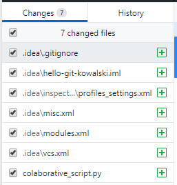

# 12 - System kontroli wersji - Git

## System kontroli wersji

System kontroli wersji (ang. *version/revision control system*) jest to oprogramowanie służące do śledzenia zmian (najczęściej w kodzie źródłowym) oraz pomocy programistom w łączeniu zmian dokonanych przez wiele osób w różnych momentach ([http://pl.wikipedia.org/wiki/System_kontroli_wersji](http://pl.wikipedia.org/wiki/System_kontroli_wersji)). Jednym z popularnych rozproszonych systemów kontroli wersji jest Git stworzony przez Linusa Torvaldsa na potrzeby rozwoju jądra Linuxa ([http://pl.wikipedia.org/wiki/Git_(oprogramowanie)](http://pl.wikipedia.org/wiki/Git_(oprogramowanie))).

Dodatkowe materiały:

* Strona projektu git: http://git-scm.com/
* Darmowa książka: http://git-scm.com/book
* Tutorial GitHub: https://guides.github.com/

## Program GitHub Desktop, konto w serwisie GitHub

Utwórz konto w serwisie [GitHub](https://github.com/). Pamiętaj, że GitHub jest bardzo popularnym serwisem wśród społeczności open-source, rozważnie wybierz alias pod którym będziesz widoczny w serwisie. Wszystkie treści publikowane na GitHub, włącznie z projektami i kodem, są domyślnie publiczne. Profil GitHub może być Twoją wizytówką!

Zwyczajowo obsługa systemu kontroli wersji odbywa się za pomocą programu `git` wywoływanego z linii poleceń. Istnieje jednak szereg GUI ułatwiających pracę z programem git. Jednym z nich jest GitHub Desktop. Ściągnij program ze strony https://desktop.github.com/ i zainstaluj. Jeżeli jest to pierwsze uruchomienie programu zostaniesz poproszony o zalogowanie się swoim kontem GitHub. W przeciwnym wypadku program poprosi Cię o zalogowanie później.

**Pamiętaj aby po skończonych laboratoriach wylogować się w programie!**

Warto upewnić się, że program GitHub Desktop ma odpowiednio ustawioną tożsamość użytkownika (w laboratorium z programu korzysta wiele osób). Dzięki temu wgrywane do repozytorium zmiany będą markowane naszą nazwą użytkownika i adresem e-mail. W tym celu z menu *File* wybierz *Options…* (jeśli menu nie jest widoczne, możesz użyć skrótu *Ctrl*+*,*):


Następnie w zakładce Git wyedytuj nazwę oraz adres email:


## Tworzenie repozytorium

GitHub Desktop służy do zarządzania lokalnymi repozytoriami znajdującymi się na dysku komputera. Pierwszym krokiem umożliwiającym nam pracę jest utworzenie lokalnego repozytorium w folderze naszego projektu. W tym celu klikamy:


Następnie nadaj nazwę swojemu repozytorium: *hello-git-nazwisko* (nie używaj w nazwie repozytorium "polskich" znaków!) i wybierz lokalizację, w której zostanie utworzony nasz projekt. Następnie wybierz konfigurację Git Ignore. Warto wskazać używany język, np. C++ (dowiedz się czym jest plik .gitignore). Utwórz lokalne repozytorium klikając *Create Repository*.

Obejrzyj zawartość folderu z utworzonym repozytorium. Zauważ, że pojawił się ukryty folder *.git*. Zastanów się co zawiera?

W górnym lewym rogu znajduje się rozwijana lista repozytoriów:


Z niej masz możliwość wybrania aktualnego repozytorium z którym pracujesz. W tym momencie nasze repozytorium istnieje tylko na lokalnym komputerze. Należy umieścić je na serwerze GitHub. W tym celu klikamy:


Jeżeli dotychczas nie wykonaliśmy logowania programu do serwisu GitHub, zostaniemy o to poproszeni.

Jeśli nie chcemy, aby repozytorium było publiczne, pozostawiamy zaznaczone pole *Keep this code private*. Darmowe konto w portalu GitHub pozwala na tworzenie prywatnych repozytoriów współdzielonych maksymalnie przez 3 użytkowników. Potwierdzamy chęć opublikowania repozytorium i czekamy na wysłanie danych na serwer.

Przejdź do swojego profilu na GitHub i obejrzyj utworzone repozytorium.

### Pierwszy commit

Nadajmy sens naszemu pierwszemu repozytorium! Bezpośrednio w utworzonym folderze projektowym *hello-git-nazwisko* stwórz projekt przykładowego programu wykorzystującego SFML oraz OpenGL, zgodnie z instrukcją do laboratorium 07.

Wróć do programu GitHub Desktop. Zauważ że program automatycznie wykrył wprowadzone zmiany w plikach. Wyświetlana jest lista zmodyfikowanych plików i treść modyfikacji. Zmiany powinny obejmować 3 pliki: *main.cpp*, *.pro* i *.pro.user*:



Czas wysłać zmiany do serwisu GitHub. W tym celu w polu “Summary” umieść opis wykonanych zmian, przy każdej kolejnej zmianie należy tu umieścić krótki komentarz na temat wykonanych w kodzie prac. Wykonaj commit zmian za pomocą przycisku:


W tym momencie poinformowaliśmy lokalne repozytorium o wprowadzonych zmianach, należy jeszcze je wysłać na serwer (push). W tym celu wciśnij przycisk:


Wykonane powyżej czynności odpowiadają wykonaniu komend:

```bash
git commit
git push
```

Wróć na stronę serwisu GitHub, otwórz repozytorium i przejrzyj czy wszystkie pliki zostały poprawnie wgrane.

### Zarządzanie przez WWW, plik README

Każde repozytorium powinno zawierać plik *README*. Serwis GitHub.com udostępnia proste narzędzie online ułatwiające jego edycję. Aby dodać plik *README* zaloguj się przez przeglądarkę w serwisie i kliknij:


Wypełnij plik *README* treścią zawierającą nazwę repozytorium, autora, wykorzystane narzędzia etc. W plikach *README* możliwe jest wykorzystanie prostych znaczników do formatowania tekstu typu [Markdown](https://help.github.com/articles/basic-writing-and-formatting-syntax/).

Dodaj plik do repo wykonując jego commit:


Wykonane na zdalnym repozytorium zmiany można natychmiast ściągnąć do lokalnego repozytorium. W tym celu w programie GitHub Desktop wybierz opcję *Fetch* w celu ściągnięcia informacji o aktualnym stanie zdalnego repozytorium:


a następnie:


Wykonanie tych operacji odpowiada wykonaniu komend `git fetch` oraz `git merge`. W folderze naszego projektu powinien być już widoczny plik *README*.

Wysyłanie kolejnych zmian do zdalnego repozytorium jest równie proste. Otwórz projekt w środowisku Qt Creator i zmodyfikuj program, tak aby rysował trzy kostki. Wróć do GitHub Desktop i wyślij zmiany dodając nowy *commit* (i opisując wprowadzone zmiany) i wypchnij (*push*) zmiany na serwer.

Na stronie GitHub w zakładce *Commits* swojego repozytorium możesz obserwować zmiany dokonane w poszczególnych commitach, przywrócić wcześniejszą wersję i wiele innych. Zapoznaj się z nimi samodzielnie. 

Podobnie jak inne serwisy społecznościowe GitHub umożliwia komunikację między użytkownikami. Znajdź profil kolegi/koleżanki i zacznij go obserwować (*follow*). Poszukaj interesujących projektów i oznacz je jako jako obserwowane (*watch*/*star*).

## Współpraca nad projektami

Jedną z najważniejszych funkcjonalności gita jest możliwość kooperacji wielu autorów przy jednym projekcie. W serwisie GitHub.com wróć do swojego nowego repozytorium *hello-git-nazwisko* i w zakładce *Settings*/*Collaborators* dodaj profil koleżanki/kolegi siedzących obok. Od tego momentu wybrany użytkownik ma możliwość modyfikowania Twojego repozytorium.

Połącz się w grupę dwuosobową z kolegą/koleżanką obok i wzajemnie dodajcie swoje profile do swoich repozytoriów.

Aby rozpocząć pracę nad zmianą projektu innego użytkownika należy *sklonować* jego projekt (`git clone`). W tym celu wróć do programu GitHub Desktop i z menu wybierz *Clone repository*:


Następnie odszukaj repozytorium współautora programu i kliknij:


Otwórz sklonowany projekt w środowisku programistycznym i zmień kierunek obrotu kostek.

W GitHub Desktop wybierz zmienione lokalne repozytorium i dodaj nowy commit oraz wyślij go na serwer.

Ściągnij zmiany do swojego repozytorium wykonane przez kolegę/koleżankę zgodnie z punktem k.

**Pamiętaj aby po skończonych laboratoriach wylogować się z programu GitHub Desktop!** W tym celu wybierz *File* &rarr; *Options…* , a następnie w zakładce *Accounts* kliknij *Sign Out*.

Warto także usunąć lokalne repozytoria z dysku komputera i z programu GitHub Desktop. W tym celu wybierz odpowiednie repozytorium i z menu *Repository* wybierz *Remove*.

Możesz także usunąć repozytorium stworzone w czasie laboratorium, aby nie zaśmiecać swojego profilu na GitHub (*Settings* &rarr; *Options* &rarr; *Danger Zone* &rarr; *Delete this repository*).

## Zadania

* Zapoznaj się z tutorialem do GitHub: https://guides.github.com/. Przeczytaj ze zrozumieniem tematy do *Be Social* włącznie.
* Czym jest folder *.git* i co zawiera?
* Czym jest plik *.gitignore* i co zawiera? Zmodyfikuj plik *.gitignore* tak, aby zmiany w plikach *.pro.user* nie były śledzone. Korzystając z serwisu GitHub.com usuń z repozytorium wcześniej dodany plik *.pro.user*
* Czasami w czasie wspólnej pracy nad jednym plikiem może dojść do konfliktu. Dlaczego? W takiej sytuacji wykonywana jest operacja *merge*. Dowiedz czym jest *merge*, jak się go stosuje i jak sobie z tym radzić!
* Zastanów się jakie pliki mogą znaleźć się w repozytorium? Czy odpowiednie jest wrzucanie plików .exe lub .bin? Czy można wrzucić do repozytorium projekt spakowany za pomocą .zip? Dlaczego odpowiedź na powyższe pytania jest przecząca? Które pliki definiujące projekt/środowisko programistyczne powinny znaleźć się w repozytorium?


---

Autorzy: *Tomasz Mańkowski*, *Jakub Tomczyński*
