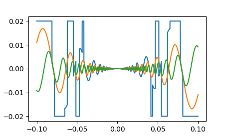
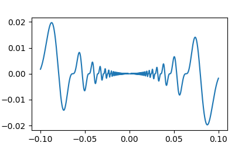

# PRZYKŁADOWE Kolokwium II - Python

Kolokwium trwa 90 minut. Na kolokwium pracujemy samodzielnie. Jakiekolwiek próby ściągania wykryte w trakcie trwania testu jak i w procesie sprawdzania skutkują oceną niedostateczną. Niedozwolone jest korzystanie z Internetu, za wyjątkiem materiałów udostępnionych na zajęciach na stronie: [https://moodle.put.poznan.pl/](https://moodle.put.poznan.pl/). Niedozwolone jest korzystanie z tzw. "gotowców".

Przed końcem czasu rozwiązanie kolokwium należy umieścić w przygotowanym przez prowadzącego miejscu na kursie Moodle. Czas otwarcia zadania jest ograniczony, pamiętaj aby wgrać rozwiązania przed upływem czasu! Zadanie akceptuje pliki o rozszerzeniach: `.py`.

Na Moodle do oceny umieść następujące pliki:

- *zadanie_1.py*
- *zadanie_2.py*
- *zadanie_3.py*

Korzystając ze środowiska **PyCharm** napisz skrypty dla interpretera **Python 3**:

## Zadanie 1

Dany jest plik *urodzenia.txt* w którym umieszczono imiona i nazwiska osób wraz z ich datą i godziną urodzenia, w następującym formacie:

```plaintext
imie nazwisko@dzień/miesiąc/rok@godzina:minuty  
imie nazwisko@dzień/miesiąc/rok@godzina:minuty  
...
```

Napisz skrypt który wypisze listę osób z pliku wraz informacją czy dana osoba urodziła się przed południem (12:00), czy po południu, wraz z informacją o dacie urodzenia w formacie ISO. Należy uzyskać wyjście z programu odpowiadające poniższemu przykładowi:

> Sam Reese urodzony przed południem w dniu 1902-06-28  
> Sarah-Louise Eastwood urodzony przed południem w dniu 1919-03-21  
> Peyton Spencer urodzony po południu w dniu 1923-10-05  
> ...

## Zadanie 2

Korzystając z biblioteki *numpy* wykonaj zadanie:

- Dana jest funkcja opisana równaniem:


- Dla wartości wektora x = [-0.1, 0.1] z liczbą próbek równą 50000, oblicz wartości funkcji y(x) dla następujących wartości parametru A i β:
    - y1: A = 4, β = 0.5,
    - y2: A = 2, β = 1,
    - y3: A = 1, β = 2,
    
- Dla zakresu wektora x dla którego funkcja y2 przyjmuje wartości większe od 0.003, funkcji y1 przypisz wartości 0.02.

- Dla zakresu wektora x dla którego funkcja y2 przyjmuje wartości mniejsze od -0.003, funkcji y1 przypisz wartości -0.02.
    
- Na wspólnym wykresie wykreśl wszystkie 3 przebiegi po modyfikacji y1. Dodaj opisy osi x: *x* oraz osi y: *Wartości funkcji*. Dodaj legendę:
    - *x1*,
    - *x2*,
    - *x3*.



- Na oddzielnym wykresie wyświetl sumę sygnału y2 i y3. Dodaj opisy osi x: *x* oraz osi y: *y2 + y3*.



## Zadanie 3

Dany jest plik *data.csv* typu CSV, w którym w pierwszej kolumnie znajduje się indeks czasu wyrażony w sekundach. Wczytaj plik korzystając z biblioteki *pandas*, a następnie:
- wybierz fragment wczytanych przebiegów dla którego indeks czasu przyjmuje wartości od 0.75 do 2.25 sekundy i zapisz do zmiennej o nazwie: *fragment*,
- utwórz nowy DataFrame zawierający 3 kolumny z następującymi wartościami (***podpowiedź***: skorzystaj z odpowiednich funkcji biblioteki *numpy*):
    - *ABS*: wartość bezwzględna z kolumny *TRIGO_1* z wyciętej części przebiegu *fragment*,
    - *MEAN*: wartość średnia z kolumn *TRIGO_1*, *TRIGO_2* i *TRIGO_3* z wyciętej części przebiegu *fragment*,
    - *MAX*: maksymalną wartość z kolumn *TRIGO_2*, *TRIGO_3* i *TRIGO_4* z wyciętej części przebiegu *fragment*,
- do nowoutworzonego DataFrame dodaj kolumnę *RANDOM* zawierającą wartości losowe z zakresu 10 do 15,
- dodaj kolejną kolumnę *RANDOM_ADDED* do której przypiszesz wartość kolumny *RANDOM* z dodaną wartością 25,
- zapisz nowoutworzony DataFrame do pliku CSV o nazwie *data_out.csv*,
- wyświetl nowy DataFrame na wykresie.


---

Autorzy: *Tomasz Mańkowski*, *Jakub Tomczyński*
